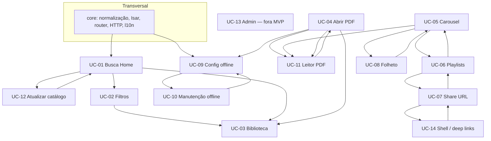
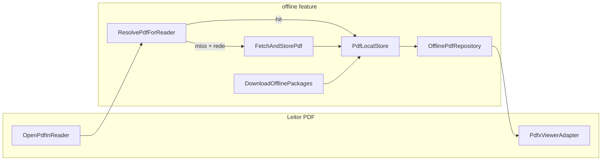

# MVP Roadmap — PLPCG Flutter (coldigui)

**Última atualização:** junho de 2026  
**Objetivo:** guia de implementação ordenado por dependências reais, alinhado ao [FEATURE_INDEX](features/FEATURE_INDEX.md) e aos 14 UCs em [`docs/use-cases/`](use-cases/).

---

## Escopo do MVP

### Incluído (prioridade Alta no mapeamento)

| # | Capacidade | UCs | Feature |
|---|------------|-----|---------|
| 1 | Catálogo + manifest | UC-12 (parcial), UC-01, UC-02 | `catalog` |
| 2 | Biblioteca completa | UC-03 | `library` |
| 3 | Abertura de PDF | UC-04 | `pdf_opening` |
| 4 | Leitor PDF | UC-11 | `pdf_reader` |
| 5 | Cache offline local-first | UC-09, UC-10 | `offline` |
| 6 | Core transversal | — | `core`, `app_shell`, `l10n` |

### Prioridade Média (pós-MVP imediato)

| Capacidade | UCs | Feature |
|------------|-----|---------|
| Carousel | UC-05 | `carousel` |
| Playlists + share URL | UC-06, UC-07 | `playlists` |
| Folheto | UC-08 | `leaflet` |
| Deep links de playlist | UC-14 (parcial) | `app_shell` |
| Atualização automática de catálogo | UC-12 (poll SHA-256) | `catalog` |

### Fora do MVP

| UC | Motivo |
|----|--------|
| UC-13 | `FeatureFlags.enableAdminUpload=false` — upload admin JWT |

---

## Estado atual (baseline)

| Feature | Status | Próximo passo |
|---------|--------|---------------|
| `core` | ✅ Concluído (Fase 0) | — |
| `app_shell` | ✅ Concluído (Fase 4.7) | — |
| `catalog` | ✅ Concluído (Fase 1.5) | `PollManifestChecksum` (Fase 5) |
| `library` | ✅ Concluído (Fase 1.4 + 1.5) | — |
| `pdf_opening` / `pdf_reader` | Em progresso (Fase 2.1/2.3/2.5 ✅, 4.7 ✅) | Backlog 2.4 fullscreen, 2.6 external |
| `offline` | ✅ Concluído (Fase 3.7) | — |
| `carousel` | ✅ Concluído (Fase 4.1) | — |
| `playlists` | ✅ Concluído (Fase 4.2–4.5) | — |
| `leaflet` | ✅ Concluído (Fase 4.6) | — |
| Demais | Esqueleto / backlog | Fase 5 |

Ordem oficial registrada no FEATURE_INDEX:

```text
core → catalog → library → pdf_opening → pdf_reader → offline → carousel/playlists → leaflet
```

---

## Grafo de dependências (UCs)

Os campos **Dependências** nos markdowns de UC descrevem **integração funcional completa**, não ordem estrita de codificação.



---

## Ciclos documentados — como quebrar na implementação

| Ciclo | UCs | Estratégia |
|-------|-----|------------|
| Catálogo | UC-01 ↔ UC-12 | UC-01 exige só **manifest carregado** (`LoadLouvoresManifest`). Poll SHA-256 e refresh automático (UC-12) vêm **depois** da home/biblioteca. |
| PDF | UC-04 ↔ UC-11 | Entregar UC-04 incrementalmente: modo `leitor` + rota primeiro; UC-11 entrega a tela; depois `share`/`save`/`newtab`/`online`. |
| Seleção | UC-05 ↔ UC-06 ↔ UC-08 | UC-05 MVP = add/reorder/clear **sem** salvar playlist nem folheto. UC-06 e UC-08 plugam em seguida. |
| Compartilhamento | UC-06 ↔ UC-07 ↔ UC-14 | Shell básico **cedo** (já existe). Importação via `sharepdfs`/`sharename` só após UC-07. |
| Offline | UC-09 ↔ UC-10 | **Resolver local-first** (3.1–3.4) antes de bulk UC-09. UC-09 = prefetch chunked + resume. UC-10 = reconcile em background (nunca boot); stats Isar; aviso PDFs removidos — ver § restrições Fase 3. |

---

## Fases de implementação

### Fase 0 — Fundação transversal

**Bloqueia:** todas as fases seguintes.

| # | Entrega | Arquivos / use cases | Critério de pronto |
|---|---------|----------------------|-------------------|
| 0.1 | Normalização PDF §10.3 | `PdfPathNormalizer` | `normalizePdfUrl` + testes; implementar `getPdfRelPath` |
| 0.2 | Busca tolerante | `LouvorSearchTokens` | `normalize`, `tokenize` + testes ✅ |
| 0.3 | Schemas Isar | `LouvorCache`, `CarouselEntry`, `Playlist`, `OfflinePdfIndex` | `@collection` + `dart run build_runner build` |
| 0.4 | Provider Isar | `isarProvider` | Abre DB com os 4 schemas |
| 0.5 | HTTP + prefs | `dioProvider`, `sharedPreferencesProvider` | Override de prefs em `main` |
| 0.6 | Router + shell | `appRouterProvider`, `ShellScaffold` | 5 destinos navegáveis ✅ |
| 0.7 | Sync URL (constantes) | `UrlSyncParams` | Query params mapeados ✅ |
| 0.8 | l10n wired | `ColdiguiApp` + ARBs | `AppLocalizations` em uso na Home |

**Checkpoint:** `flutter analyze` OK; testes core verdes; app abre e navega entre telas.

---

### Fase 1 — Catálogo utilizável

**UCs:** UC-01, UC-02, UC-03 (parcial)  
**Feature:** `catalog` → `library`

| # | Entrega | Use case / widget | Critério de pronto |
|---|---------|-------------------|-------------------|
| 1.1 | Carregar manifest | `LoadLouvoresManifest`, `CatalogRepositoryImpl` | JSON remoto → Isar; fallback cache offline |
| 1.2 | Busca na Home | `SearchLouvorByNumberOrText`, `HomeScreen`, `SearchBar` | Debounce 300ms; número exato prioritário; home exige texto |
| 1.3 | Filtros | `FilterByMaterialAndArranjo`, `CategoryFilters` | Material, arranjo; Cifra expande I/II; sync URL |
| 1.4 | Biblioteca | `BrowseLibrary`, `SortLouvores`, `PaginateLouvores`, `LibraryScreen` | Ordenação, paginação 10/25/50/100; sem busca obrigatória |
| 1.5 | Refresh manual | `ForceRefreshCatalog` | ✅ Banner "Atualizar lista" na biblioteca; `skipLoadingOnReload`; l10n UC-12 |

**Adiar para Fase 5:** `PollManifestChecksum` (poll automático UC-12).

**Checkpoint:** buscar louvor na home; filtrar; navegar biblioteca paginada; card pode ser no-op até Fase 2.

---

### Fase 2 — Abrir e ler PDF

**UCs:** UC-04, UC-11  
**Features:** `pdf_opening` → `pdf_reader`

| # | Entrega | Use case | Critério de pronto |
|---|---------|----------|-------------------|
| 2.1 | Abrir leitor (online) | `OpenPdfInReader` | Card → `/leitor?file=...&titulo=...`; PDF remoto via HTTP |
| 2.2 | Renderizar PDF | `OpenPdfDocument`, `PdfxViewerAdapter` | PDFx abre URL remota ou fixture local |
| 2.3 | Navegação e zoom | `NavigatePdfPages`, `SetZoomAndFitMode` | Swipe/scroll, page-fit/width, pinch |
| 2.4 | Fullscreen | `ToggleReaderFullscreen` | Long-press centro |
| 2.5 | Share / save | `SharePdf`, `SavePdf` | `share_plus` |
| 2.6 | Modos secundários | `OpenPdfExternal` | `newtab`, `online` (prioridade baixa) |
| 2.7 | Biblioteca E2E | UC-03 + UC-04 | Card da biblioteca abre PDF online de ponta a ponta |

**Por que antes de offline:** o leitor funciona com PDF remoto (R2/HTTP); offline só enriquece validação e retry. Entregar UC-04 modo `leitor` + UC-11 viewer primeiro desbloqueia o fluxo principal cedo.

**Adiar para Fase 3:** resolver local-first (`ResolvePdfForReader`) — lookup no dispositivo, fetch+store on miss, retry offline no leitor (UC-11 fluxo alternativo).

**Checkpoint:** fluxo completo home/biblioteca → leitor com PDF **online**; viewer isolado com fixture local também válido.

---

### Fase 3 — Sistema offline nativo (local-first)

**UCs:** UC-09, UC-10  
**Feature:** `offline`

#### Mudança de arquitetura em relação à PWA

A versão web (SvelteKit) dependia de **pacotes ZIP por categoria**, **Cache Storage** e a flag `OFFLINE_AVAILABLE` — padrão que gerou dessincronização entre índice, stats e arquivos reais. No app nativo, o offline deixa de ser um “modo” separado e passa a ser um **store local confiável**, transparente para o leitor:

```text
Abrir PDF → ResolvePdfForReader(pdfId)
              ├─ hit  → File local (PDFx abre path nativo)
              └─ miss → FetchAndStorePdf → grava atômico → indexa → File local
```

| Camada | Responsabilidade | Onde |
|--------|------------------|------|
| **Filesystem** | Bytes do PDF; escrita atômica (`.tmp` → rename) | `path_provider` + `PdfLocalStore` → **`ApplicationDocumentsDirectory/plpcg_pdfs/`** |
| **Índice Isar** | Fonte de verdade: `pdfId` → path, categoria, tamanho, `downloadedAt` | `OfflinePdfIndex` |
| **Resolver** | Local-first + fetch on miss; retry com backoff | `ResolvePdfForReader` |
| **Bulk (opcional)** | Prefetch por categoria/ZIP em background | UC-09 — complementa, não substitui o resolver |

**O que não replicamos da PWA:** Service Worker, Cache Storage API, flag `OFFLINE_AVAILABLE` como gate de abertura, stats lazy dessincronizados com o cache real.



| # | Entrega | Use case / componente | Critério de pronto |
|---|---------|----------------------|-------------------|
| 3.1 | Camada de storage | `PdfLocalStore`, `OfflinePdfRepository` | PDFs **somente** em `ApplicationDocumentsDirectory/plpcg_pdfs/`; **proibido** `cache/` e `temp/`; escrita atômica (`.tmp` → rename); CRUD `OfflinePdfIndex`; paths via `PdfPathNormalizer` |
| 3.2 | Resolver local-first | `ResolvePdfForReader` | Lookup O(1) por `pdfId`; valida disco (`exists`, `size > 0`); hit → path absoluto; miss → delega fetch; PDF apagado externamente → miss + erro claro + CTA re-fetch quando online |
| 3.3 | Cache on-demand | `FetchAndStorePdf` | Miss + rede: HTTP → `.tmp` → rename → upsert índice; retry (`OfflineConfig.maxRetryAttempts`); funciona **sem** bulk download |
| 3.4 | Integração leitor + share/save | `OpenPdfInReader`, `PdfReaderScreen`, `SharePdf`, `SavePdf`, `ValidatePdfAvailability`* | Resolver → rota `file` = **path absoluto local** (hit); PDFx `openFile`; share hit → `Share.shareXFiles([XFile(localPath)])` sem reler bytes; save hit → `File.copy` cache → `saved_pdfs/` |
| 3.5 | Prefetch em lote (UC-09) | `DownloadOfflinePackages`, `ExtractAndStorePdfs` | ZIP/categoria em background (isolate/`compute`); chunks Isar 50–100 PDFs/txn; fila + resume por categoria; check espaço livre antes; `ReconcileOfflineIndex` ao fim de cada categoria; UI nunca bloqueada |
| 3.6 | Manutenção (UC-10) | `ReconcileOfflineIndex`, `GetOfflineStatsByCategory`, `DownloadMissingPdfs`, `ClearOfflineCache`, `MigrateOfflineStorage` | Reconcile **idempotente**, isolate, chunked, **< 20s para 5000 entradas**; **proibido** no boot/`main()`; stats só Isar (sem scan disco); triggers: foreground debounced, `OfflineSettingsScreen`, pós-bulk |
| 3.7 | UI offline | `OfflineSettingsScreen`, `OfflineIndicator`, `offlineCacheStatusProvider` | Abrir tela offline dispara reconcile em background; aviso “X PDFs deixaram de estar disponíveis” + CTA `DownloadMissingPdfs`; badge via contagem Isar (rápida), não flag fixa |

\* `ValidatePdfAvailability` permanece como alias fino sobre o resolver (UC-04); a lógica central migra para `ResolvePdfForReader`.

#### Restrições transversais (Fase 3)

| Restrição | Regra |
|-----------|--------|
| **Cold start** | Zero I/O de PDF no boot — só manifest Isar + prefs; reconcile completo **adiado** |
| **Persistência** | `plpcg_pdfs/` em documents — dados perenes até desinstalar/limpar dados da app |
| **UI thread** | Escrita bulk, extração ZIP e reconcile completo em isolate/background — nunca bloqueiam frames |
| **Indicador offline** | Contagem Isar O(1) — não percorre disco no shell |
| **Reconcile completo** | Só em: foreground (debounced), abrir `OfflineSettingsScreen`, pós-bulk por categoria |
| **Reconcile por PDF** | Sob demanda no `ResolvePdfForReader` (1 stat por abertura) |

**Ordem de implementação recomendada:** 3.1 → 3.2 → 3.3 → 3.4 (MVP offline utilizável) → 3.5–3.7.

**Por que depois de PDF:** o leitor online (Fase 2) continua válido; a Fase 3 **substitui a URL remota direta** pelo resolver, que devolve path local sempre que possível — melhor performance, retry offline e base para UC-09/10.

**Checkpoint mínimo (3.4):** abrir PDF **sem** bulk — 1º tap baixa e persiste; 2º tap abre local (`openFile`); share WhatsApp e save usam path local; modo avião só para PDFs cacheados; cold start sem scan de PDFs.

**Checkpoint completo (3.7):** prefetch 1 categoria com resume; reconcile < 20s/5000 em background; aviso de PDFs removidos externamente; stats e indicador consistentes.

---

### Fase 4 — Seleção, playlists e folheto

**UCs:** UC-05, UC-06, UC-07, UC-08, UC-14 (deep links)  
**Features:** `carousel` → `playlists` → `leaflet`

| # | Entrega | Use case | Critério de pronto |
|---|---------|----------|-------------------|
| 4.1 | Carousel CRUD | `AddLouvorToCarousel`, `RemoveLouvorFromCarousel`, `ReorderCarousel`, `ClearCarousel` | Chips persistidos em Isar |
| 4.2 | Playlists CRUD | `CreatePlaylistFromCarousel`, `UpdatePlaylist`, `DeletePlaylist`, `TogglePlaylistFavorite` | Modelo id/nome/pdfIds/createdAt/favorita |
| 4.3 | Carregar playlist | `LoadPlaylistIntoCarousel` | Playlist → carousel |
| 4.4 | Share URL | `GeneratePlaylistShareUrl`, `ImportSharedPlaylistFromUrl` | `/?sharepdfs=...&sharename=...` |
| 4.5 | Deep links | `SyncDeepLinkState` | ✅ Import automático ao abrir link |
| 4.6 | Folheto | `GenerateLeafletFromSelection` | Imagem/HTML para impressão |
| 4.7 | Carousel no leitor | `NavigateCarouselInReader` | Navegar seleção sem sair do leitor |

**Ordem dentro do ciclo:** UC-05 → UC-06 → UC-07 → UC-14 → UC-08.

**Checkpoint:** montar seleção, salvar playlist, compartilhar URL, destinatário importa, gerar folheto.

---

### Fase 5 — Polimento

| # | Entrega | UC | Critério de pronto |
|---|---------|-----|-------------------|
| 5.1 | Poll automático | UC-12 | `PollManifestChecksum` em background + retry 4x |
| 5.2 | Performance | — | Bulk/reconcile em isolate; cold start zero I/O PDF; reconcile < 20s/5000 em background |
| 5.3 | Testes integração | UC-01, UC-09, UC-11 | Substituir placeholders em `test/integration/` |
| 5.4 | Admin (opcional) | UC-13 | Só se `enableAdminUpload=true` |

---

## Visão por ondas

```text
Fase 0  ████████░░  core + Isar codegen + l10n wired
Fase 1  ████████░░  UC-01 → UC-02 → UC-03
Fase 2  ████████░░  UC-04 (leitor) + UC-11
Fase 3  ██████░░░░  UC-09/10 — store local-first + resolver no leitor
Fase 4  ██████░░░░  UC-05 → UC-06 → UC-07 → UC-08 (+ UC-14 deep links)
Fase 5  ████░░░░░░  UC-12 poll + testes integração
```

---

## Trabalho paralelo (após Fase 0)

| Trilha | Escopo | Converge em |
|--------|--------|-------------|
| A | UC-01/02 — home + filtros | Fase 1 |
| B | UC-11 viewer isolado + UC-04 abrir leitor online | Fase 2 |
| C | `PdfLocalStore` + `ResolvePdfForReader` (1 PDF on-demand) | Fase 3.1–3.4 |

Convergência obrigatória na **Fase 3.4** (resolver local-first integrado ao leitor; bulk UC-09 pode seguir em 3.5).

---

## Checklist por sessão de dev

Use com o pipeline de agentes ([AGENT_PIPELINE.md](AGENT_PIPELINE.md)):

1. Identificar **fase** e **UC** alvo (ex.: `/plpcg-feature-dev UC-01`).
2. Confirmar **pré-requisitos** da fase anterior no [FEATURE_INDEX](features/FEATURE_INDEX.md).
3. Implementar use case + provider + widget mínimo.
4. Adicionar testes unitários (core/domain) ou integração quando E2E.
5. Rodar `flutter analyze` + `flutter test`.
6. Atualizar FEATURE_INDEX via `plpcg-docs-creator`.

---

## Referências

| Documento | Conteúdo |
|-----------|----------|
| [FEATURE_INDEX.md](features/FEATURE_INDEX.md) | Status e APIs públicas |
| [MAPEAMENTO_PLPCG_FLUTTER.md](../MAPEAMENTO_PLPCG_FLUTTER.md) | Spec completa SvelteKit → Flutter |
| [docs/use-cases/](use-cases/) | 14 UCs detalhados |
| [ADR-001 — Isar](adr/ADR-001-isar-storage.md) | Persistência local |
| [ADR-002 — PDFx](adr/ADR-002-pdfx-reader.md) | Leitor PDF |
| §10.3 MAPEAMENTO | Contrato `PdfPathNormalizer` — testes obrigatórios antes de offline/PDF |

---

## Próximos passos imediatos

1. **Fase 5:** `PollManifestChecksum` — poll automático SHA-256 (UC-12).
2. **Backlog Fase 2:** 2.4 `ToggleReaderFullscreen`, 2.6 `OpenPdfExternal` (`newtab`/`online`).
3. **Deploy deep links:** configurar AASA em `plpcg.com` — ver [deep-links-setup.md](deep-links-setup.md).
