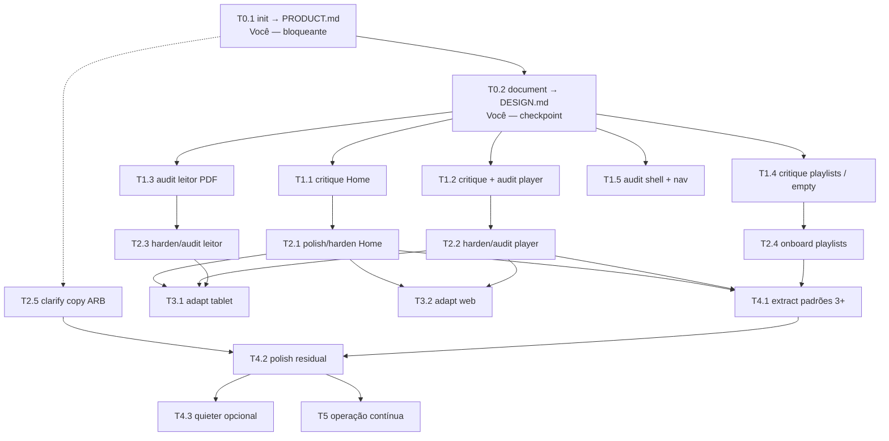

# Refatoração UI/UX com Impeccable

Guia operacional para usar a skill [impeccable](https://github.com/pbakaus/impeccable) neste repositório **sem redesenhar o app**. O objetivo é refinar a identidade já existente (vinho, creme, ouro; Garamond no display; Open Sans no corpo) e fechar buracos de UX — estados, copy, acessibilidade, tablet/web — tela a tela.

Este documento não autoriza um “visual world” novo. Refinamento **preserva**. Redesign **substitui** e só entra se for pedido de forma explícita.

**Skill:** `~/.agents/skills/impeccable/SKILL.md`  
**Autoridade visual hoje:** `lib/core/theme/` (`AppColors`, `AppTypography`, `AppTheme`) + rule `.cursor/rules/flutter-theme-contrast.mdc`  
**Modo da skill neste produto:** **Operate** (UI de tarefa, não landing page)  
**Plataforma:** **adaptive** (iOS, Android e web)

---

## Princípios que não negociamos

1. **A brief vence.** A paleta litúrgica, as duas superfícies e a regra de contraste são pinning. Agente que “melhora” isso rumo a dark theme Material genérico falhou.
2. **Operate, não Persuade.** Scanabilidade, vocabulário estável, affordances nativas. Brand vive em detalhes precisos (borda gold, chip dual, Garamond no AppBar) — não em motion decorativo.
3. **Uma superfície por vez.** Nunca “impeccable no app inteiro”.
4. **Verificar em passes limitados.** Construir, inspecionar uma rodada (classes de device que o app realmente envia), corrigir o lote, confirmar no máximo mais uma vez, parar.
5. **Ponytail continua valendo.** Impeccable aqui é piso de qualidade de produto (estados, tokens, consistência), não licença para maximalismo. Não usar `overdrive`, `delight` ou `bolder` como default.
6. **O detector HTML/CSS e o modo `live` são web-only.** No Flutter nativo eles não enxergam widgets. O `context.mjs` pode reportar `hasVisualImplementation: false` porque procura CSS, não Dart — ignore esse sinal. A verdade visual está em `lib/core/theme/`.

### Duas superfícies (não esquecer)

| Superfície | Token | Texto |
|---|---|---|
| Scaffold / chrome / banners escuros | `AppColors.background`, `btnBackground` | `AppColors.textLight` |
| Cards, inputs, sheets creme | `AppColors.card` | `AppColors.title` |

`ThemeData.textTheme` / `onSurface` usam `title` (ok em cards). Texto solto no scaffold **precisa** de `textLight` explícito.

### O que não usar neste piloto

| Comando / ferramenta | Por quê |
|---|---|
| `$impeccable live` | Overlay e detector no browser; não se aplica a widget Flutter nativo |
| `detect.mjs` em arquivos `.dart` | Motor HTML/CSS |
| Hook automático pós-edit | Mesmo motor web; ruído no Flutter |
| `overdrive` / `delight` / `bolder` | Identidade já é expressiva; Operate pede familiaridade |
| `new-work` de substituição de mundo | Só se alguém pedir redesign explícito |
| Skill `frontend-design` (web marketing) | Direção estética nova a cada tela; aqui a autoridade é o `DESIGN.md` extraído |

---

## Atenção: o que é seu vs. o que o agente faz sozinho

Legenda usada em cada tarefa:

| Tag | Significado |
|---|---|
| **Você — bloqueante** | Entrevista, decisão de produto ou aprovação. Sem isso a fase não fecha. |
| **Você — checkpoint** | Olhar rápido (2–10 min): escolher opção, validar copy, ver screenshot. |
| **Agente — segundo plano** | Scan, auditoria de código, implementação, testes, simulador. Pode rodar enquanto você faz outra coisa. |
| **Sessão conjunta** | Agente conduz, você responde no chat na hora. Não dá para deixar overnight. |

**Sua atenção vale mais em:** quem é o usuário e o job (init); se o `DESIGN.md` descreveu o tema certo (document); prioridade entre telas; copy que muda significado (`clarify`); empty states que ensinam (`onboard`); o que adaptar primeiro (tablet vs web); o que fazer com os P0 de um `critique`.

**Pode ir para segundo plano:** extração de tokens a partir do tema; `audit` native (a11y, hex solto, listas); overflow/i18n estrutural (`harden`); screenshots de simulador/emulador; `extract` de padrões repetidos depois de aprovado o recorte; `polish` de uma superfície já criticada.

Hardware real (gesto de voltar, Dynamic Island, teclado, jank) **não** é segundo plano: o agente captura simulador; postura e performance pedem o seu device.

---

## Grafo de dependências



Linha pontilhada: `clarify` pode **começar rascunho** depois do init (precisa de vocabulário de produto), mas **não mergeia** copy factual sem o checkpoint seu.

**Paralelo permitido**

- Depois de T0.2: T1.1, T1.2, T1.3, T1.4 e T1.5 em paralelo (diagnóstico, sem código de UI).
- Depois dos diagnósticos: T2.1–T2.4 em paralelo **se** cada uma ficar numa superfície (Home ≠ player ≠ leitor ≠ playlists). Não misturar diffs.
- T2.5 (`clarify`) pode correr em paralelo com T2.x, mas o merge de ARB pede o seu olho.
- T3.1 e T3.2 são paralelizáveis entre si depois das superfícies-core (Home, player, leitor) terem passado por T2 — senão você adapta um layout que ainda vai mudar.
- T4.1 só depois de pelo menos duas superfícies T2 terem convergido (senão o “padrão” é chute).

**Não paralelizar**

- T0.1 e T0.2 (document precisa do produto para não inventar voz; init não escreve DESIGN.md).
- Diagnóstico e correção da **mesma** superfície ao mesmo tempo.
- `extract` (T4.1) no meio de um polish local — extrai o que ainda está mudando.

---

## Fase 0 — Fundação

Nenhum pixel. Dois artefatos que impedem o agente de rediscutir paleta e persona em toda sessão.

### T0.1 — Capturar verdade de produto

| | |
|---|---|
| **Comando** | `$impeccable init` |
| **Atenção** | **Sessão conjunta / Você — bloqueante** |
| **Depende de** | nada |
| **Desbloqueia** | T0.2, rascunho de T2.5 |

Entrevista curta (no máximo 3 rodadas). O init **não** pergunta paleta, fonte nem “feel”. Confirmar o que o repo já sugere, não inventar:

- Ator: músico / regente (ver UC-01).
- Jobs: buscar louvor (PLPCG + Coldigom), ler PDF, ouvir áudio, montar playlist/folheto, usar offline.
- Plataforma: adaptive (iOS, Android, web).
- Constraints: pt/en, contraste das duas superfícies, sem redesign.

**Pronto quando:** existe `PRODUCT.md` na raiz com facts confirmados e decisões em aberto **marcadas** como abertas — sem prosa genérica.

### T0.2 — Carbonizar o design system incumbente

| | |
|---|---|
| **Comando** | `$impeccable document` (scan mode, nunca `--seed`) |
| **Atenção** | **Agente — segundo plano** na extração; **Você — checkpoint** na linguagem descritiva |
| **Depende de** | T0.1 |
| **Desbloqueia** | toda a Fase 1 e qualquer `polish` / `extract` |

Fonte: `lib/core/theme/color_extensions.dart`, `app_typography.dart`, `app_theme.dart`. Tokens mínimos a aparecer: `background`, `card`, `title`, `textLight`, `gold`, `goldLight`, `btnBackground`, `chipColdigom`, sombras, raios, Garamond só em display, Open Sans no UI.

**Pronto quando:** existe `DESIGN.md` na raiz (spec DESIGN.md: frontmatter de tokens + seções canônicas). A rule de contraste continua válida; o `DESIGN.md` é o que agentes de UI leem.

Não sobrescrever `DESIGN.md` depois sem perguntar. Drift se resolve com `$impeccable doctor` **só se você pedir** — nunca como efeito colateral de uma tarefa de UI.

---

## Fase 1 — Diagnóstico (só relatório)

Não implementar. Cada tarefa produz um relatório e, no `critique`, um snapshot em `.impeccable/critique/` que o `polish` posterior usa como backlog.

Rodar **em paralelo** depois de T0.2. Cada crítica/auditoria aponta um path concreto (arquivo da screen), não “o app”.

### T1.1 — Critique da Home (carga cognitiva dual)

| | |
|---|---|
| **Comando** | `$impeccable critique lib/features/catalog/presentation/pages/home_screen.dart` |
| **Atenção** | **Agente — segundo plano** nas duas assessments; **Você — checkpoint** nas perguntas finais do critique |
| **Alvo** | UC-01 / UC-02 — busca, chips vermelhos vs pretos/dourados, filtros |
| **Depende de** | T0.2 |
| **Desbloqueia** | T2.1 |

Pergunta de produto: dois acervos na mesma Home ajudam ou saturam? O critique pontua heurísticas e carga cognitiva (>4 opções visíveis).

### T1.2 — Critique + audit do player de áudio

| | |
|---|---|
| **Comando** | `$impeccable critique` no screen do player **e** `$impeccable audit` (variante native) |
| **Atenção** | Agente no código/simulador; **Você — checkpoint** se o player web for first-class agora |
| **Alvo** | `lib/features/audio_player/presentation/pages/audio_player_screen.dart` + contrato em `docs/features/AUDIO_BACKGROUND_CONTRACT.md` |
| **Depende de** | T0.2 |
| **Desbloqueia** | T2.2 |

Audit native: labels, alvos 44 pt / 48 dp, estados loading/erro/fila, sessão em background. Não usar `detect.mjs`.

### T1.3 — Audit do leitor PDF

| | |
|---|---|
| **Comando** | `$impeccable audit` native em `pdf_reader_screen.dart` |
| **Atenção** | **Agente — segundo plano**; evidência de simulador. Hardware (swipe, notch, teclado) é **seu** se o audit marcar plataforma. |
| **Alvo** | UC-11 — `_ReaderScaffold`, fullscreen, carousel no leitor, insets |
| **Depende de** | T0.2 |
| **Desbloqueia** | T2.3 |

Dimensões do audit native: a11y, performance (listas/páginas), theming vs hex solto, conformidade de plataforma, adaptivity.

### T1.4 — Critique dos empty states de playlists

| | |
|---|---|
| **Comando** | `$impeccable critique lib/features/playlists/presentation/pages/playlists_screen.dart` |
| **Atenção** | Agente + **Você — checkpoint** (“o empty ensina a ação ou só informa vazio?”) |
| **Alvo** | UC-06 — abas unsaved / saved / favorites |
| **Depende de** | T0.2 |
| **Desbloqueia** | T2.4 |

`PlaylistsScreen` já é a referência de empty com `textLight`. O critique verifica se o empty chega ao primeiro valor.

### T1.5 — Audit do app shell e navegação

| | |
|---|---|
| **Comando** | `$impeccable audit` native no shell (`PlpcgBottomNavBar`, `PlpcgPrimaryAppBar`, `ShellScaffold`) |
| **Atenção** | **Agente — segundo plano** |
| **Alvo** | UC-14 — tab bar, safe area, gesto de voltar, ícones misturados |
| **Depende de** | T0.2 |
| **Alimenta** | T3.1 / T3.2 (nav muda de forma no tablet) e polish residual |

Não precisa de uma fase T2 própria se o audit só achar drift pequeno — entra em T4.2.

**Pronto da Fase 1:** cinco relatórios (ou quatro + shell) com P0/P1 nomeados. Você escolhe a ordem da Fase 2. Default sugerido se não escolher: player (trabalho quente) → Home → leitor → playlists.

---

## Fase 2 — Correção por superfície

Implementação. Uma superfície por branch/diff. Ordem interna de cada superfície, quando couber:

`shape` (só se a estrutura da tarefa for aberta) → código → `harden` / `clarify` se faltar estado ou copy → `polish` (lê o snapshot do critique).

`layout` / `typeset` só se a tela estiver “certa mas bagunçada”. `quieter` só se ouro/glow/sombra estiver competindo com a tarefa — não no default.

### T2.1 — Home: hierarquia e chips dual

| | |
|---|---|
| **Comandos** | `clarify` se a confusão for copy; `layout` se for hierarquia; `polish` no fim |
| **Atenção** | **Você — checkpoint** em qualquer mudança de significado dos chips (PLPCG vs Coldigom) |
| **Depende de** | T1.1 |
| **Desbloqueia** | T3.x, T4.1 |

Escopo: busca, filtros, chips, empty de busca. Não redesenhar a Home.

### T2.2 — Player: estados e plataforma

| | |
|---|---|
| **Comandos** | `harden` (fila, erro de stream, unlock web, i18n) + `audit` de novo se mexer em controles + `polish` |
| **Atenção** | Agente no código; **Você — checkpoint** no fluxo real de play (iOS/Android/web que vocês suportam neste ciclo) |
| **Depende de** | T1.2 |
| **Desbloqueia** | T3.2 (web) com mais peso |

Respeitar `AUDIO_BACKGROUND_CONTRACT.md`. Não inventar media session paralela.

### T2.3 — Leitor: gestos, insets, estados

| | |
|---|---|
| **Comandos** | `harden` (PDF ausente, sessão loading, carousel vazio) + correções do audit + `polish` |
| **Atenção** | Agente; **Você** em hardware se T1.3 marcou conformidade de plataforma |
| **Depende de** | T1.3 |
| **Desbloqueia** | T3.1 (tablet: master-detail vs telefone esticado) |

### T2.4 — Playlists: empty que ensina

| | |
|---|---|
| **Comando** | `$impeccable onboard` na `PlaylistsScreen` (não tutorial modal) |
| **Atenção** | **Você — checkpoint**: o “aha” é montar a primeira lista a partir do carousel, não “conhecer o app” |
| **Depende de** | T1.4 |
| **Desbloqueia** | T4.1 (empty state vira candidato a padrão se Biblioteca/Social repetirem) |

Onboarding opcional, skippável, no contexto do empty — não uma tour na primeira abertura.

### T2.5 — Copy (ARB)

| | |
|---|---|
| **Comando** | `$impeccable clarify` nos fluxos, não string a string |
| **Atenção** | **Você — bloqueante** para claims, termos de domínio (louvor, arranjo, folheto, coldigom) e tom de erro |
| **Depende de** | T0.1 (vocabulário); melhor depois dos critiques T1 |
| **Arquivos** | `lib/l10n/app_pt.arb`, `lib/l10n/app_en.arb` |

Cada estado de erro/empty deve responder: o que falhou, por quê se for útil, o que fazer agora. Botão destrutivo nomeia o objeto. Sem `OK` / `Sim` genéricos.

**Pronto da Fase 2:** P0/P1 das superfícies escolhidas fechados; empty/erro/loading daquela superfície existem; copy das strings tocadas passou pelo seu olho.

---

## Fase 3 — Adaptividade

Risco: layout de telefone **esticado**. A skill `adapt` (variante native) manda **reestruturar** (size class, split view, rail), não escalar.

Só depois das superfícies-core (T2.1–T2.3) — senão você adapta markup que ainda vai mudar.

### T3.1 — Tablet (iPad / Android large)

| | |
|---|---|
| **Comando** | `$impeccable adapt` native — phone → tablet |
| **Atenção** | **Você — bloqueante** na prioridade (iPad vs Android tablet primeiro) e na estrutura (lista+detalhe no leitor? rail no lugar da bottom bar?) |
| **Depende de** | T1.5 + T2.1–T2.3 |
| **Evidência** | Simulador/emulador tablet (já existe `flutter emulators --launch coldigui_tablet`); hardware se possível |

Nunca: bottom bar de telefone intocada em expanded width; lock de orientação para esconder bug.

### T3.2 — Web como classe de device

| | |
|---|---|
| **Comando** | `$impeccable adapt` para o contexto web (hover, teclado, viewport, player) |
| **Atenção** | **Você — checkpoint**: a web neste ciclo é first-class ou fallback? Isso muda o quanto o player web entra |
| **Depende de** | T2.1 + T2.2 (player web está quente no git) |

Aqui `live` / `detect.mjs` **podem** aplicar se a superfície alvo for o build Flutter web servido em localhost — e **somente** então. Não ligar o hook no restante do repo Dart.

**Pronto da Fase 3:** pelo menos um telefone e um tablet por plataforma que vocês enviam neste ciclo, mais web se T3.2 estiver no recorte. Screenshots vêm de simulador/`adb`, não de browser, para o nativo.

---

## Fase 4 — Sistema e fechamento

### T4.1 — Extract de padrões repetidos 3+ vezes

| | |
|---|---|
| **Comando** | `$impeccable extract` |
| **Atenção** | **Você — checkpoint** no recorte (o que vira widget compartilhado) |
| **Depende de** | pelo menos duas superfícies T2 convergidas |
| **Candidatos** | empty state (Playlists / Biblioteca / Social), card de louvor, sheet de materiais, tagged container dourado |

Não criar design system paralelo ao `ThemeData`. Extract só o que já se repetiu três vezes com a mesma intenção. Anti-overengineering: se não há 3 usos, não extrai.

### T4.2 — Polish residual

| | |
|---|---|
| **Comando** | `$impeccable polish` nas superfícies que ainda tiverem P1 do critique, mais o shell (T1.5) |
| **Atenção** | **Agente — segundo plano**; **Você — checkpoint** em screenshot final |
| **Depende de** | T2.x relevantes + T2.5 se copy ainda estiver aberta |

Polish **não** é redesign disfarçado. Se o conceito da tela estiver errado, parar e voltar a `shape` / critique — não “embelezar o errado”.

### T4.3 — Quieter (opcional)

| | |
|---|---|
| **Comando** | `$impeccable quieter` |
| **Atenção** | **Você — bloqueante** para autorizar; default é **não fazer** |
| **Quando** | gold glow, sombra ou Garamond em label de UI estiver competindo com a tarefa |

Não é fase obrigatória. Só se T1 ou T4.2 apontarem ruído visual, não “falta de personalidade”.

---

## Fase 5 — Operação contínua (não é um sprint)

A partir daqui a skill deixa de ser “refatoração” e vira hábito em feature nova. Encaixa no pipeline já existente:

```text
plpcg-uc-refinement → plpcg-feature-dev → (UI: impeccable) → QA → OpSec → Perf → Docs
```

### Receita por feature com UI

1. `$impeccable shape [feature]` **antes** de código se a tarefa ou a hierarquia forem abertas. **Você — sessão conjunta.**
2. Implementar na arquitetura atual (feature-dev / Riverpod). Sem `new-work` de identidade.
3. `$impeccable audit` native no path tocado (segundo plano).
4. `harden` / `clarify` se a feature introduz empty, erro, permissão ou string nova.
5. `$impeccable polish` no path antes do merge.
6. `adapt` só se a feature for visível em tablet/web e o layout de telefone não servir.

`shape` não pergunta CSS. `craft` é alias deprecado de new-work — não usar.

### Doctor e hooks

- `$impeccable doctor` quando alguém perguntar se PRODUCT/DESIGN/hook estão stale. Não “consertar drift” no meio de uma tarefa de UI.
- Não ativar `$impeccable hooks on` neste repo Flutter até existir um alvo web isolado de verdade.

---

## Mapa rápido comando → uso neste repo

| Comando | Fase | Uso |
|---|---|---|
| `init` | 0 | PRODUCT.md |
| `document` | 0 | DESIGN.md a partir do tema |
| `critique` | 1 | Review heurístico de uma screen |
| `audit` native | 1–2, 5 | a11y, touch, tokens, plataforma, adaptivity |
| `shape` | 2 (se aberto), 5 | Brief sem código |
| `harden` | 2, 5 | overflow, offline, erro, i18n |
| `onboard` | 2.4 | empty → primeiro valor |
| `clarify` | 2.5, 5 | ARB, erros, labels |
| `polish` | 2, 4.2, 5 | passe final; lê critique |
| `layout` / `typeset` | 2 se necessário | ritmo e hierarquia |
| `adapt` native | 3, 5 | tablet / web / orientação |
| `extract` | 4.1 | padrão 3+ |
| `quieter` | 4.3 opcional | reduzir ruído gold/glow |
| `live` / `detect.mjs` | só T3.2 se Flutter web localhost | nunca no Dart nativo |

Referências nativas da skill (o agente deve carregar na hora do audit/adapt, não agora): `reference/operate.md`, `audit.native.md`, `adapt.native.md`, `ios.md`, `android.md`.

---

## Superfícies e arquivos âncora

| Superfície | Path principal | UC |
|---|---|---|
| Home | `lib/features/catalog/presentation/pages/home_screen.dart` | UC-01, UC-02 |
| Biblioteca | `lib/features/library/presentation/pages/library_screen.dart` | UC-03 |
| Leitor PDF | `lib/features/pdf_reader/presentation/pages/pdf_reader_screen.dart` | UC-11 |
| Playlists | `lib/features/playlists/presentation/pages/playlists_screen.dart` | UC-06 |
| Player | `lib/features/audio_player/presentation/pages/audio_player_screen.dart` | (contrato de áudio) |
| Offline | `lib/features/offline/presentation/pages/offline_settings_screen.dart` | UC-09, UC-10 |
| Shell | `lib/features/app_shell/` | UC-14 |
| Social | `lib/features/social/presentation/pages/social_screen.dart` | — |
| Tema | `lib/core/theme/` | transversal |
| Copy | `lib/l10n/app_pt.arb`, `app_en.arb` | transversal |

Biblioteca, Offline, Social e Sobre **não** estão no caminho crítico da Fase 2. Entram em T4.2 se o audit do shell ou um critique pontual apontar P0, ou na Fase 5 quando a feature for tocada por outro motivo.

---

## Relação com o que já existe

| Artefato | Papel depois deste guia |
|---|---|
| `.cursor/rules/flutter-theme-contrast.mdc` | Continua always-on; `DESIGN.md` não a substitui |
| `docs/features/FEATURE_INDEX.md` | Status de feature; este guia não duplica o índice |
| `docs/AGENT_PIPELINE.md` | Pipeline de UC; Fase 5 encaixa Impeccable **depois** do feature-dev, **antes** do QA visual |
| `docs/use-cases/UC-*.md` | Job da tela; init/shape leem, não reescrevem |
| `MAPEAMENTO_PLPCG_FLUTTER.md` | Origem PWA; anti-referência se alguém quiser “voltar ao site” |
| Anti-overengineering / ponytail | Continuam: menor diff que resolve o P0; sem componente novo “porque ficou bonito” |

---

## Checklist de fechamento da refatoração (Fases 0–4)

- [ ] `PRODUCT.md` na raiz, facts confirmados, abertos marcados
- [ ] `DESIGN.md` na raiz, tokens batem com `AppColors` / `AppTypography`
- [ ] Critique ou audit das quatro superfícies-core (Home, player, leitor, playlists)
- [ ] P0 de cada superfície-core no recorte fechado
- [ ] Empty/erro/loading dessas superfícies existem e estão em pt/en
- [ ] Tablet: pelo menos uma estrutura que não seja telefone esticado (se T3.1 no recorte)
- [ ] Web: player e Home usáveis no viewport alvo (se T3.2 no recorte)
- [ ] Extract só com 3+ usos reais, ou explicitamente pulado
- [ ] Nenhum hook Impeccable web ligado no repo Flutter
- [ ] Nenhuma identidade visual nova introduzida “no caminho”

---

## Como começar a próxima sessão

Prompt mínimo, sem reabrir este debate:

> Segue `docs/REFACT_IMPECCABLE.md`. Vamos a **T0.1** (`$impeccable init`). Não implemente UI.

Troque `T0.1` pelo id da tarefa. O agente carrega a skill, roda `context.mjs` uma vez, e executa **só** aquele comando.
