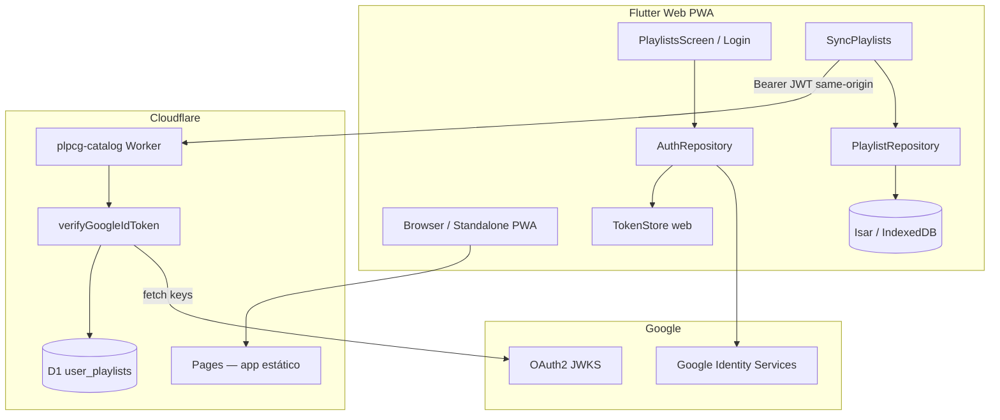

# Spec — Auth Google + Sync de Playlists (Opção A)

**Criado em:** 2026-06-16  
**Atualizado em:** 2026-07-05  
**Versão:** 1.1  
**Status:** Planejado — **não implementado**  
**Público:** agente de desenvolvimento (`plpcg-feature-dev`) via `/plpcg-feature-dev UC-15` (criar UC antes de codar)  
**Complementa:** UC-06, UC-07, UC-13 (admin separado), [FEATURE_INDEX.md](features/FEATURE_INDEX.md)

---

## 0. Prioridade de plataforma

| Plataforma | Prioridade | Notas |
|------------|------------|-------|
| **Web (PWA)** | **Primária** | Entrega principal; deploy em Cloudflare Pages; instalação standalone via `manifest.json` |
| iOS | Secundária | Implementar após MVP web estável; sujeita a revisão jurídica das lojas |
| Android | Secundária | Idem iOS |

**Contexto estratégico:** problemas jurídicos com distribuição nativa (App Store / Play Store) levaram à decisão de **priorizar Web/PWA** para reduzir dependência de políticas de loja. O codebase Flutter continua multiplataforma, mas **auth, sync e critérios de pronto** desta spec tratam **Web primeiro**; iOS/Android entram como fase posterior sem bloquear o MVP.

**Implicações:**

- OAuth, CORS, armazenamento de sessão e UX de login são desenhados para **browser + PWA instalada**.
- Backend e Worker assumem **mesma origem** ou CORS explícito para origens PLPCG (`https://v2.plpcg.com`, previews Pages).
- Testes manuais e automatizados de auth/sync **obrigatórios em Web** antes de validar nativo.

---

## 1. Objetivo

Permitir que o usuário **entre com Google**, tenha um **identificador estável** (`sub`) reconhecido pelo app e pelo backend, e **sincronize playlists online** entre dispositivos — mantendo **offline-first** com Isar como cache local.

**Decisão arquitetural:** Google Sign-In + validação de JWT no Cloudflare Worker + persistência em D1. **Não** usar Cloudflare Access como auth de usuário final (Access permanece candidato apenas para admin/upload — UC-13).

**Entrega alvo:** **PWA de alta qualidade** — instalável, offline-first, login Google integrado, sync de listas salvas/favoritas entre browsers/dispositivos com a mesma conta Google.

---

## 2. Escopo

### Dentro do escopo (MVP desta feature)

| Item | Descrição |
|------|-----------|
| Login / logout | Google OAuth no **Flutter Web (PWA)** — **prioridade MVP**; iOS/Android na fase 2 |
| Crachá | ID token Google validado no Worker; `user_id` = claim `sub` |
| API REST | CRUD de playlists do usuário autenticado |
| Sync | Push/pull entre Isar (IndexedDB na web) e D1; merge com `updated_at` + `version` |
| Migração | Ao primeiro login, playlists locais existentes sobem para a conta |
| UX mínima | Botão “Entrar com Google” em `/listas` (ou aba Perfil); indicador de conta logada |
| PWA | Login funciona em browser tab **e** em PWA standalone (`display: standalone`) |

### Fora do escopo (adiar)

| Item | Motivo |
|------|--------|
| Cloudflare Access para usuários | Identity layer de produto, não de usuário final |
| Sync em tempo real (WebSocket) | Complexidade desnecessária no MVP |
| Compartilhamento UC-07 na nuvem | Share URL continua local/deep link; não exige login |
| Contas além de Google | Extensível depois via mesma camada `auth` |
| UC-13 admin upload | Continua JWT HMAC ou Access — rota separada |
| Exclusão de conta / LGPD export | Backlog futuro |
| Auth nativo (lojas) | Adiado por estratégia jurídica; não bloqueia MVP web |

### Dados sincronizados

| Sincroniza | Não sincroniza |
|------------|----------------|
| Playlists **salvas** (`salva == true`) | Rascunhos (`salva == false`) |
| Playlists **favoritas** (salvas + `favorita == true`) | Carousel temporário |
| Metadados: nome, pdfIds, datas, favorito | PDFs binários (continuam offline/catálogo) |

---

## 3. Contexto do codebase (estado atual)

### Já implementado

| Peça | Local |
|------|-------|
| Playlists locais (Isar) | `lib/core/database/collections/playlist.dart` |
| Isar na web (IndexedDB/WASM) | `lib/core/database/isar_bootstrap_web.dart`, `web/isar_plus.*` |
| PWA manifest + ícones | `web/manifest.json`, `web/icons/` |
| Headers COOP/COEP (Isar/WASM) | `web/_headers` |
| Entidade de domínio | `lib/features/playlists/domain/entities/saved_playlist.dart` |
| Repositório local-only | `lib/features/playlists/data/repositories/playlist_repository_impl.dart` |
| Worker catálogo (GET only) | `workers/plpcg-catalog/src/index.ts` |
| CORS catálogo (allowlist) | `ALLOWED_ORIGINS` no Worker |
| D1 catálogo | `workers/plpcg-catalog/migrations/0001_create_louvores.sql` |
| HTTP client | `lib/core/providers/dio_provider.dart` + `AppConfig.apiBaseUrl` |
| Rotas API catálogo | `GET /api/catalog/louvores`, `GET /api/catalog/checksum` |
| Smoke tests web | `test/web/chrome_smoke_test.dart` |

### Modelo Isar atual (`Playlist`)

```dart
playlistId   // UUID estável — reutilizar como PK remota
nome
pdfIds       // List<String>, ordem preservada
createdAt
salva        // false = rascunho automático — NÃO sync
savedAt
favoritedAt
favorita
```

### Lacunas a preencher

- Campos de sync no Isar: `updatedAt`, `version`, `syncStatus`, `deletedAt` (soft delete opcional)
- Feature `auth` (nova) em `lib/features/auth/`
- Endpoints autenticados no Worker + **CORS para métodos mutáveis** (PUT/DELETE/POST)
- Migration D1 `user_playlists`
- Interceptor Dio com `Authorization: Bearer <id_token>`
- Script GIS / meta tag em `web/index.html` (se necessário para `google_sign_in` web)
- Avaliar `Cross-Origin-Opener-Policy` vs popup Google (ver §12 W1)

---

## 4. Arquitetura alvo



### Vantagem same-origin (Web)

Quando app PWA e API compartilham origem (ex.: `https://v2.plpcg.com` servindo app + Worker em `/api/*`):

- **Sem preflight CORS** para requests same-origin
- Cookies httpOnly (fase 2 opcional) com `SameSite=Lax`
- Menor superfície de misconfiguration de CORS

Se app e API estiverem em origens diferentes, CORS allowlist **obrigatória** (já parcialmente implementada no Worker para catálogo).

### Fluxo de login (Web — MVP)

```text
1. Usuário toca "Entrar com Google"
2. google_sign_in (web) / GIS abre fluxo OAuth (popup ou redirect — ver §12 W1)
3. Retorna credential com idToken (NÃO enviar accessToken ao backend)
4. App persiste idToken + expiry via AuthTokenStore (web: ver §9)
5. Worker valida JWT → extrai sub, email, name
6. App dispara SyncPlaylists (pull → push)
```

### Fluxo de login (iOS/Android — fase 2)

```text
Mesmo fluxo; token em flutter_secure_storage.
Worker valida aud contra GOOGLE_CLIENT_ID_IOS / ANDROID além do WEB.
```

### Fluxo de request autenticada

```text
Client: Authorization: Bearer <google_id_token>
Worker:
  1. Parse JWT header (kid)
  2. Busca JWKS Google (cache em memória do isolate, TTL ~1h)
  3. Verifica assinatura RS256
  4. Valida: exp, iss ∈ {accounts.google.com, https://accounts.google.com}
  5. Valida: aud ∈ {GOOGLE_CLIENT_ID_WEB, ...} (web MVP: só WEB)
  6. ctx.userId = payload.sub — NUNCA aceitar user_id do body
```

---

## 5. Google Cloud Console — setup

### OAuth clients (prioridade Web)

| Cliente | Prioridade | Uso | Onde configurar |
|---------|------------|-----|-----------------|
| **Web** | **MVP** | `aud` validado no Worker; GIS no Flutter Web | Google Cloud → Credentials → OAuth 2.0 Client IDs |
| iOS | Fase 2 | `google_sign_in` nativo | Bundle ID |
| Android | Fase 2 | `google_sign_in` nativo | SHA-1 debug + release |

### Configuração Web (obrigatória no MVP)

| Campo | Valor |
|-------|-------|
| **Authorized JavaScript origins** | `https://v2.plpcg.com`, `https://plpcg-v2.pages.dev`, `http://localhost:*` (dev) |
| **Authorized redirect URIs** | Mesmas origens + path se usar redirect flow (ex.: `/`, `/oauth/callback`) |
| **Application type** | Web application |

**Client ID Web** exposto no frontend é **esperado e seguro** (não é secret). O que protege o usuário é validação server-side do id_token.

### Variáveis / secrets

| Nome | Onde | Fase |
|------|------|------|
| `GOOGLE_CLIENT_ID_WEB` | Worker secret + `--dart-define` Flutter Web | MVP |
| `GOOGLE_CLIENT_ID_IOS` | `--dart-define` / xcconfig | Fase 2 |
| `GOOGLE_CLIENT_ID_ANDROID` | `android/app/build.gradle` ou define | Fase 2 |

**Não commitar** client secrets OAuth. Fluxo web/mobile público usa client ID + PKCE; secret só se houver backend confidential client (não necessário no MVP).

### Escopos Google

- `openid`
- `email`
- `profile`

### Tela de consentimento OAuth

Configurar nome do app, logo, domínio autorizado e política de privacidade — **obrigatório** para produção e reduz avisos “app não verificado”.

---

## 6. Backend — D1 schema

**Arquivo:** `workers/plpcg-catalog/migrations/0002_create_user_playlists.sql`

```sql
-- Migration number: 0002  2026-06-16T00:00:00.000Z
CREATE TABLE user_playlists (
  id           TEXT NOT NULL,          -- playlistId (UUID do app)
  user_id      TEXT NOT NULL,          -- Google sub
  nome         TEXT NOT NULL,
  pdf_ids      TEXT NOT NULL,          -- JSON array de strings
  salva        INTEGER NOT NULL DEFAULT 1,
  saved_at     TEXT,                   -- ISO-8601 UTC ou NULL
  favorita     INTEGER NOT NULL DEFAULT 0,
  favorited_at TEXT,
  created_at   TEXT NOT NULL,
  updated_at   TEXT NOT NULL,
  version      INTEGER NOT NULL DEFAULT 1,
  deleted_at   TEXT,                   -- soft delete; NULL = ativo
  PRIMARY KEY (user_id, id)
);

CREATE INDEX idx_user_playlists_user_updated
  ON user_playlists(user_id, updated_at);

CREATE INDEX idx_user_playlists_user_deleted
  ON user_playlists(user_id, deleted_at);
```

### Regras de isolamento

- Toda query inclui `WHERE user_id = ?` com `?` = `sub` do JWT validado.
- `id` no body deve coincidir com o path; rejeitar mismatch.
- Playlists com `deleted_at IS NOT NULL` não aparecem em `GET`; `DELETE` seta `deleted_at`.
- Rejeitar sync de registros com `salva == false` (defesa em profundidade — cliente não deveria enviar).

---

## 7. Backend — API REST

**Base:** mesma origem do catálogo — `AppConfig.apiBaseUrl` (ex.: `https://v2.plpcg.com`).

**Binding Worker:** estender `workers/plpcg-catalog/src/index.ts` ou extrair módulos `src/auth/` e `src/playlists/`.

### Rotas públicas (inalteradas)

| Método | Path | Auth |
|--------|------|------|
| GET | `/api/catalog/louvores` | Não |
| GET | `/api/catalog/checksum` | Não |

### Rotas autenticadas (novas)

| Método | Path | Descrição |
|--------|------|-----------|
| GET | `/api/playlists` | Lista playlists do usuário (`deleted_at IS NULL`) |
| GET | `/api/playlists/:id` | Uma playlist |
| PUT | `/api/playlists/:id` | Upsert com versionamento otimista |
| DELETE | `/api/playlists/:id` | Soft delete |
| POST | `/api/playlists/sync` | **Opcional MVP+** — batch upsert + retorno de conflitos |

### Payload JSON (espelha `SavedPlaylist`)

```json
{
  "id": "550e8400-e29b-41d4-a716-446655440000",
  "nome": "Culto domingo",
  "pdfIds": ["Q29s...", "QXZ1..."],
  "salva": true,
  "savedAt": "2026-06-16T12:00:00.000Z",
  "favorita": false,
  "favoritedAt": null,
  "createdAt": "2026-06-10T10:00:00.000Z",
  "updatedAt": "2026-06-16T12:00:00.000Z",
  "version": 3
}
```

### PUT — versionamento otimista

```text
Request: body.version = N
Server:
  - Se row não existe → INSERT version=1
  - Se row existe e row.version === N → UPDATE, version=N+1, updated_at=now
  - Se row.version > N → 409 Conflict + body atual
  - Se row.version < N (cliente mais novo) → aceitar se updated_at cliente > servidor
```

**Regra MVP simplificada:** last-write-wins por `updated_at` (ISO comparável); `version` incrementa a cada write bem-sucedido.

### Códigos HTTP

| Código | Quando |
|--------|--------|
| 401 | Token ausente, expirado ou inválido |
| 403 | Tentativa de acessar playlist de outro `user_id` |
| 404 | Playlist inexistente para este usuário |
| 409 | Conflito de versão (se habilitado) |
| 429 | Rate limit Cloudflare |

### CORS (rotas autenticadas — **crítico para Web**)

O catálogo hoje permite apenas `GET` + `OPTIONS`. Playlists exigem **extensão do CORS**:

| Requisito | Detalhe |
|-----------|---------|
| Origens | Mesma allowlist: `https://v2.plpcg.com`, `https://plpcg-v2.pages.dev`, previews `*.plpcg-v2.pages.dev` |
| Métodos | `GET, PUT, POST, DELETE, OPTIONS` |
| Headers | `Authorization`, `Content-Type` |
| Credentials | `Access-Control-Allow-Credentials: true` **somente** se usar cookies (fase 2); com Bearer, `false` |
| **Proibido** | `Access-Control-Allow-Origin: *` com credentials |

**Preferência:** deploy PWA e API na **mesma origem** → CORS mínimo ou desnecessário para o app principal.

### Rate limiting

- Dashboard Cloudflare ou binding para `/api/playlists/*`
- Sugestão: 60 req/min por IP; considerar por `sub` no futuro

---

## 8. Backend — validação JWT (Worker)

**Arquivo sugerido:** `workers/plpcg-catalog/src/auth/verify_google_token.ts`

### Dependência

- `jose` (leve, compatível Workers) — **aprovação explícita** antes de `npm install`.

### Pseudocódigo

```typescript
const GOOGLE_ISSUERS = ['https://accounts.google.com', 'accounts.google.com'];
const JWKS_URL = 'https://www.googleapis.com/oauth2/v3/certs';

async function verifyGoogleIdToken(token: string, env: Env): Promise<GoogleClaims> {
  // 1. jwtVerify com remote JWKS (cache 1h em globalThis)
  // 2. aud === env.GOOGLE_CLIENT_ID_WEB (MVP); fase 2: array de client IDs
  // 3. iss in GOOGLE_ISSUERS
  // 4. exp > now (+ clock skew ≤ 60s)
  // 5. return { sub, email, name, picture? }
}
```

### Middleware

```typescript
async function withAuth(request, env, handler): Promise<Response> {
  const header = request.headers.get('Authorization');
  if (!header?.startsWith('Bearer ')) return json({ error: 'unauthorized' }, 401);
  try {
    const claims = await verifyGoogleIdToken(header.slice(7), env);
    return handler(request, env, claims);
  } catch {
    return json({ error: 'unauthorized' }, 401);
  }
}
```

**Importante:** catálogo permanece GET público; apenas `/api/playlists/*` passa por `withAuth`.

---

## 9. Flutter — estrutura de features

### Nova feature `auth`

```
lib/features/auth/
  data/
    datasources/auth_local_datasource.dart      # AuthTokenStore (platform)
    datasources/auth_local_datasource_web.dart  # sessionStorage + memória
    datasources/auth_local_datasource_native.dart # flutter_secure_storage (fase 2)
    datasources/google_auth_datasource.dart     # google_sign_in
    repositories/auth_repository_impl.dart
    providers/auth_providers.dart
  domain/
    entities/auth_user.dart
    repositories/auth_repository.dart
    usecases/sign_in_with_google.dart
    usecases/sign_out.dart
    usecases/get_current_user.dart
    usecases/refresh_id_token.dart
  presentation/
    providers/auth_state_provider.dart
    widgets/sign_in_button.dart
    widgets/auth_user_chip.dart
```

### Estender feature `playlists`

```
lib/features/playlists/
  data/
    datasources/playlist_remote_datasource.dart
    repositories/playlist_repository_impl.dart  # local-first + remote
  domain/
    usecases/sync_playlists.dart
    entities/playlist_sync_result.dart
```

### Pacotes (`pubspec.yaml`)

| Pacote | Uso | Fase |
|--------|-----|------|
| `google_sign_in` | OAuth Google (suporta web) | MVP Web |
| `flutter_secure_storage` | Tokens nativos | Fase 2 iOS/Android |

### Armazenamento de token por plataforma

| Plataforma | Estratégia MVP | Racional |
|------------|----------------|----------|
| **Web** | id_token em **memória** + fallback `sessionStorage` (expiry curta ~1h) | `flutter_secure_storage` web é limitado; **nunca** `localStorage` (persiste após fechar aba → maior janela XSS) |
| iOS/Android | `flutter_secure_storage` | Keychain / EncryptedSharedPreferences |

**Fase 2 Web (opcional, mais seguro):** endpoint `POST /api/auth/session` troca id_token por **cookie httpOnly** `Secure; SameSite=Lax` — elimina token em JS. Avaliar após MVP Bearer funcionar.

### `web/index.html` — GIS

Se `google_sign_in` web exigir meta tag ou script GIS:

```html
<meta name="google-signin-client_id" content="CLIENT_ID.apps.googleusercontent.com">
<!-- ou carregar gsi/client via script — seguir doc do pacote na versão pinada -->
```

Client ID via build-time define, **não** hardcoded no repo.

### `dioProvider` — interceptor auth

```dart
// Anexar Authorization apenas a paths /api/playlists/
// Web: renovar via google_sign_in silentSignIn() em 401 (uma retry)
// Não anexar token a rotas de catálogo público
```

### Campos novos no Isar `Playlist`

```dart
DateTime updatedAt;
int version;
@enumerated
PlaylistSyncStatus syncStatus;

enum PlaylistSyncStatus { synced, pendingPush, pendingPull, conflict }
```

---

## 10. Estratégia de sync (offline-first)

### Princípio

1. **Leitura:** sempre do Isar (rápido, offline) — na web, IndexedDB via Isar WASM.
2. **Escrita local:** imediata no Isar + `syncStatus = pendingPush`.
3. **Background sync:** quando online + autenticado, `SyncPlaylists` executa.

### Algoritmo `SyncPlaylists`

```text
Pré-condição: usuário autenticado, rede disponível (connectivity_plus / navigator.onLine)

Fase A — Pull
  1. GET /api/playlists
  2. Para cada remota (salva==true):
     - Se não existe local → INSERT
     - Se remota.updatedAt > local.updatedAt → UPDATE local
     - Se local.pendingPush e local.updatedAt > remota → manter para Fase B

Fase B — Push
  3. Para cada local com syncStatus == pendingPush AND salva==true:
     - PUT /api/playlists/:id
     - Sucesso → synced, version = resposta.version
     - 409 → marcar conflict

Fase C — Deletes
  4. Tombstones locais → DELETE remoto

Pós-login (primeira vez)
  5. Playlists locais salvas → pendingPush
  6. Pull ANTES de Push (evita sobrescrever nuvem)
```

### Quando disparar sync

| Evento | Ação |
|--------|------|
| Login bem-sucedido | Sync completo |
| `visibilitychange` → visible (Web/PWA) | Debounce 30s → sync incremental |
| Após Save/Update/Delete playlist salva | `pendingPush` + sync se online |
| Pull-to-refresh em `PlaylistsScreen` | Sync manual |
| `online` event (browser) | Sync pendente |

### Rascunhos (`salva == false`)

- **Não sincronizar** — 100% locais (UC-06).

---

## 11. UX / telas (Web PWA)

### `PlaylistsScreen` (ou aba Perfil — item TODO #7)

| Estado | UI |
|--------|-----|
| Não logado | Banner: “Entre para sincronizar suas listas entre dispositivos” + `SignInButton` |
| Logado | Chip com nome/email + avatar Google + menu “Sair” |
| Sync em andamento | Indicador discreto |
| Offline logado | Listas locais funcionam; badge “Alterações pendentes” |
| Erro auth / popup bloqueado | Snackbar com instrução (“permita popups” ou “tente redirect”) |
| PWA standalone | Mesmo fluxo; testar GIS em `display: standalone` |

### Sem login obrigatório

- Usuário **pode** usar playlists só no dispositivo.
- Sync é **opt-in** via login.

### Responsividade

- Botão Google com largura adequada em mobile web (touch target ≥ 48dp).
- Login visível sem scroll em viewport comum (iPhone SE / Android pequeno).

---

## 12. Segurança (checklist OpSec)

### Regras gerais

| # | Regra | Verificação |
|---|-------|-------------|
| S1 | `user_id` só do JWT validado | Grep: nenhum `user_id` vindo de query/body |
| S2 | Tokens: web ≠ localStorage permanente | sessionStorage ou memória; nativo: secure storage |
| S3 | Não logar id_token | Grep em debug logs |
| S4 | Client ID web público OK; **sem client secret** no frontend | Code review |
| S5 | HTTPS only | Produção + HSTS Cloudflare |
| S6 | Validar `aud`, `iss`, `exp` | Testes unitários Worker |
| S7 | Rate limit `/api/playlists/*` | Dashboard CF |
| S8 | CORS allowlist — nunca `*` com credentials | Worker + testes |
| S9 | Isolamento por `sub` | Testes integração IDOR |
| S10 | Renovação token (~1h) | silentSignIn + interceptor 401 |
| S11 | Limites payload (nome, pdfIds count, body size) | Validação Worker |
| S12 | Rascunhos nunca no servidor | Filtro client + rejeição server |

### Riscos específicos Web (prioridade MVP)

| # | Risco | Mitigação |
|---|-------|-----------|
| W1 | **COOP `same-origin`** (`web/_headers`) quebra popup GIS | Testar popup; se falhar, usar **redirect flow** ou `Cross-Origin-Opener-Policy: same-origin-allow-popups` |
| W2 | **XSS** → roubo de id_token em sessionStorage | CSP restritiva (fase 2); sanitizar inputs; dependências atualizadas; evitar `innerHTML` |
| W3 | Popup bloqueado pelo browser | Fallback redirect + mensagem UX |
| W4 | Third-party cookies deprecados | GIS/FedCM first-party; não depender de cookies Google cross-site |
| W5 | Token em URL (redirect mal implementado) | Redirect flow: trocar code/token no fragment **sem** logar URL; limpar history |
| W6 | PWA cache servindo JS antigo com bug auth | `flutter_service_worker.js` no-cache (já em `_headers`) |
| W7 | CSRF em rotas Bearer | Bearer no header (não cookie) no MVP → CSRF irrelevante; se cookies fase 2 → CSRF token |
| W8 | Clickjacking | `X-Frame-Options: DENY` ou CSP `frame-ancestors 'none'` |

**Cloudflare Access:** reservar para UC-13 — não misturar com `/api/playlists`.

---

## 13. UC sugerido

Criar **`docs/use-cases/UC-15-sync-playlists-online.md`** antes da implementação:

| Campo | Valor |
|-------|-------|
| **ID** | UC-15 |
| **Feature** | `auth` + `playlists` |
| **Prioridade** | Alta (PWA / estratégia web-first) |
| **Plataforma MVP** | Web (browser + PWA standalone) |
| **Ator** | Usuário autenticado |
| **Pré-condições** | Rede (para sync); conta Google |
| **Fluxo principal** | Login → sync bidirecional → playlists em outro browser/dispositivo |
| **Pós-condições** | Isar e D1 convergentes para `salva==true` |
| **Dependências** | UC-06 |

---

## 14. Ordem de implementação (para o agente)

```text
Fase A — Backend (desbloqueia Web)
  A1. Migration D1 0002_user_playlists
  A2. verify_google_token.ts + testes vitest/miniflare
  A3. Handlers GET/PUT/DELETE playlists
  A4. CORS playlists (métodos mutáveis + Authorization header)
  A5. Rotas wrangler + secret GOOGLE_CLIENT_ID_WEB
  A6. Testes curl com id_token real (origem web)

Fase B — Flutter auth WEB (MVP)
  B1. pubspec: google_sign_in (web)
  B2. Feature auth + AuthTokenStore web
  B3. Config GCP: Web client + Authorized JavaScript origins
  B4. web/index.html meta/script GIS se necessário
  B5. SignInButton + auth_state_provider
  B6. Validar COOP vs popup (W1) — redirect se needed
  B7. Testes widget/integration em Chrome

Fase C — Flutter sync WEB
  C1. Campos sync Isar + build_runner
  C2. playlist_remote_datasource
  C3. PlaylistRepository local-first + remote
  C4. SyncPlaylists + hooks visibility/online
  C5. PlaylistsScreen UX auth/sync
  C6. Teste manual: browser A → browser B (mesma conta)

Fase D — Polish Web PWA
  D1. l10n auth/sync
  D2. Testes unitários merge
  D3. Smoke PWA standalone (instalar → login → sync)
  D4. Atualizar FEATURE_INDEX.md

Fase E — Nativo (adiado)
  E1. flutter_secure_storage + client IDs iOS/Android
  E2. Validar aud múltiplo no Worker
  E3. Testes dispositivo (quando jurídico permitir)
```

---

## 15. Critérios de pronto

| # | Critério | Plataforma |
|---|----------|------------|
| P1 | Login Google funciona em **Chrome/Safari/Firefox** (desktop + mobile web) | **Web MVP** |
| P1b | Login funciona em **PWA standalone** instalada | **Web MVP** |
| P2 | Worker rejeita token ausente/inválido (401) | Todas |
| P3 | Playlist salva no browser A aparece no browser B (mesma conta) | **Web MVP** |
| P4 | Edição offline sincroniza ao voltar online (`online` event) | **Web MVP** |
| P5 | Rascunhos (`salva=false`) **não** no servidor | Todas |
| P6 | Logout limpa tokens; playlists locais permanecem | **Web MVP** |
| P7 | Catálogo público sem login | Todas |
| P8 | `flutter analyze` + testes novos passando | CI |
| P9 | Login iOS/Android | Fase 2 |

---

## 16. Testes

### Worker (vitest + miniflare)

- Token inválido / expirado / `aud` errado → 401
- PUT cria playlist; GET isolado por `sub`
- DELETE soft
- CORS preflight OPTIONS com `Authorization` permitido

### Flutter Web

- `SyncPlaylists` merge e push
- `AuthRepository` persiste/limpa sessionStorage
- Widget: SignIn quando deslogado
- `test/web/chrome_smoke_test.dart` estendido com fluxo login mockado (se viável)

### Manual Web (obrigatório antes de merge)

1. Browser A: login → criar playlist salva → verificar D1
2. Browser B (ou aba anônima): mesma conta → playlist visível
3. B offline (DevTools) → editar → online → A sincroniza
4. Instalar PWA → repetir login + sync
5. Popup bloqueado → fallback funciona

### Manual Nativo (fase 2)

- Idem cenários A/B em iOS/Android

---

## 17. Referências internas

| Documento | Relevância |
|-----------|------------|
| [UC-06-manage-playlists.md](use-cases/UC-06-manage-playlists.md) | Modelo de playlist |
| [UC-13-admin-upload-louvor.md](use-cases/UC-13-admin-upload-louvor.md) | Auth admin separada |
| [ADR-001-isar-storage.md](adr/ADR-001-isar-storage.md) | Isar web + nativo |
| [AGENT_PIPELINE.md](AGENT_PIPELINE.md) | Pipeline QA → OpSec |
| `web/manifest.json`, `web/_headers` | PWA + COOP/COEP |
| `workers/plpcg-catalog/README.md` | Deploy Worker |

---

## 18. Referências externas

- [Google Sign-In for Flutter](https://pub.dev/packages/google_sign_in) — incluir seção Web
- [Google Identity Services (Web)](https://developers.google.com/identity/gsi/web)
- [Verify Google ID token](https://developers.google.com/identity/gsi/web/guides/verify-google-id-token)
- [JWKS Google](https://www.googleapis.com/oauth2/v3/certs)
- [jose (JWT)](https://github.com/panva/jose)
- [Cloudflare D1](https://developers.cloudflare.com/d1/)
- [MDN: PWA](https://developer.mozilla.org/en-US/docs/Web/Progressive_web_apps)

---

## 19. Riscos e mitigações

| Risco | Mitigação |
|-------|-----------|
| COOP bloqueia popup Google (W1) | Testar cedo; redirect ou `same-origin-allow-popups` |
| Token expira (~1h) | silentSignIn + retry 401 |
| XSS em PWA | CSP, deps atualizadas, token não em localStorage |
| Conflito edição simultânea | `updated_at` + `version` |
| Primeiro login sobrescreve remoto | Pull antes de Push |
| Jurídico bloqueia lojas nativas | Web-first; nativo não bloqueia MVP |
| Custo D1 | Volume baixo por usuário |
| Aprovação deps | `google_sign_in`, `jose` (MVP); `flutter_secure_storage` (fase 2) |

---

## 20. Invocação para agente

```text
/plpcg-uc-refinement UC-15
/plpcg-feature-dev UC-15
```

**Contexto mínimo a anexar:** este arquivo.

**Hooks esperados:** OpSec S1–S12 + W1–W8; Performance: debounce sync, payload `pdf_ids`, impacto COOP.

---

## Changelog

| Versão | Data | Mudança |
|--------|------|---------|
| 1.0 | 2026-06-16 | Spec inicial (multiplataforma, web opcional) |
| 1.1 | 2026-07-05 | **Web/PWA primário**; nativo fase 2; CORS/COOP/GIS; token storage web; critérios de pronto web-first |
