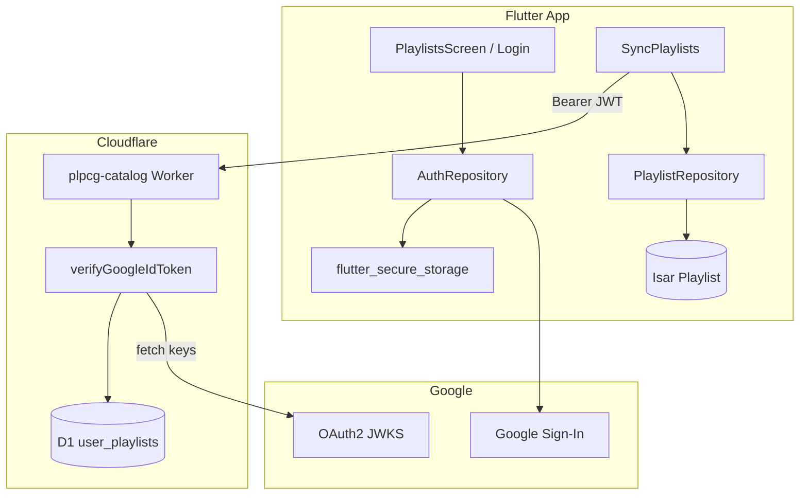

# Spec — Auth Google + Sync de Playlists (Opção A)

**Criado em:** 2026-06-16  
**Status:** Planejado — **não implementado**  
**Público:** agente de desenvolvimento (`plpcg-feature-dev`) via `/plpcg-feature-dev UC-15` (criar UC antes de codar)  
**Complementa:** UC-06, UC-07, UC-13 (admin separado), [FEATURE_INDEX.md](features/FEATURE_INDEX.md)

---

## 1. Objetivo

Permitir que o usuário **entre com Google**, tenha um **identificador estável** (`sub`) reconhecido pelo app e pelo backend, e **sincronize playlists online** entre dispositivos — mantendo **offline-first** com Isar como cache local.

**Decisão arquitetural:** Google Sign-In direto + validação de JWT no Cloudflare Worker + persistência em D1. **Não** usar Cloudflare Access como auth de usuário final (Access permanece candidato apenas para admin/upload — UC-13).

---

## 2. Escopo

### Dentro do escopo (MVP desta feature)

| Item | Descrição |
|------|-----------|
| Login / logout | Google OAuth no Flutter (iOS, Android; Web opcional nesta fase) |
| Crachá | ID token Google validado no Worker; `user_id` = claim `sub` |
| API REST | CRUD de playlists do usuário autenticado |
| Sync | Push/pull entre Isar local e D1; merge com `updated_at` + `version` |
| Migração | Ao primeiro login, playlists locais existentes sobem para a conta |
| UX mínima | Botão “Entrar com Google” em `/listas`; indicador de conta logada |

### Fora do escopo (adiar)

| Item | Motivo |
|------|--------|
| Cloudflare Access para usuários | Não funciona bem como identity layer no Flutter nativo |
| Sync em tempo real (WebSocket) | Complexidade desnecessária no MVP |
| Compartilhamento UC-07 na nuvem | Share URL continua local/deep link; não exige login |
| Contas além de Google | Extensível depois via mesma camada `auth` |
| UC-13 admin upload | Continua JWT HMAC ou Access — rota separada |
| Exclusão de conta / LGPD export | Backlog futuro |

---

## 3. Contexto do codebase (estado atual)

### Já implementado

| Peça | Local |
|------|-------|
| Playlists locais (Isar) | `lib/core/database/collections/playlist.dart` |
| Entidade de domínio | `lib/features/playlists/domain/entities/saved_playlist.dart` |
| Repositório local-only | `lib/features/playlists/data/repositories/playlist_repository_impl.dart` |
| Worker catálogo (GET only) | `workers/plpcg-catalog/src/index.ts` |
| D1 catálogo | `workers/plpcg-catalog/migrations/0001_create_louvores.sql` |
| HTTP client | `lib/core/providers/dio_provider.dart` + `AppConfig.apiBaseUrl` |
| Rotas API catálogo | `GET /api/catalog/louvores`, `GET /api/catalog/checksum` |

### Modelo Isar atual (`Playlist`)

```dart
playlistId   // UUID estável — reutilizar como PK remota
nome
pdfIds       // List<String>, ordem preservada
createdAt
salva        // false = rascunho automático
savedAt
favoritedAt
favorita
```

### Lacunas a preencher

- Campos de sync no Isar: `updatedAt`, `version`, `syncStatus`, `deletedAt` (soft delete opcional)
- Feature `auth` (nova) em `lib/features/auth/`
- Endpoints autenticados no Worker
- Migration D1 `user_playlists`
- Interceptor Dio com `Authorization: Bearer <id_token>`

---

## 4. Arquitetura alvo



### Fluxo de login

```text
1. Usuário toca "Entrar com Google"
2. google_sign_in retorna idToken (e accessToken — não enviar accessToken ao backend)
3. App persiste idToken + expiry em flutter_secure_storage
4. App chama POST /api/auth/session (opcional) ou vai direto ao sync
5. Worker valida JWT → extrai sub, email, name
6. App dispara SyncPlaylists (upload local + download remoto)
```

### Fluxo de request autenticada

```text
Client: Authorization: Bearer <google_id_token>
Worker:
  1. Parse JWT header (kid)
  2. Busca JWKS Google (cache em memória do isolate, TTL ~1h)
  3. Verifica assinatura RS256
  4. Valida: exp, iss ∈ {accounts.google.com, https://accounts.google.com}
  5. Valida: aud === GOOGLE_CLIENT_ID_WEB (secret/env)
  6. ctx.userId = payload.sub — NUNCA aceitar user_id do body
```

---

## 5. Google Cloud Console — setup

### OAuth clients necessários

| Cliente | Uso | Onde configurar |
|---------|-----|-------------------|
| **Web** | `aud` validado no Worker | Google Cloud → APIs → Credentials |
| **iOS** | `google_sign_in` no iOS | Bundle ID do app |
| **Android** | `google_sign_in` no Android | SHA-1 debug + release |

### Variáveis / secrets

| Nome | Onde | Exemplo |
|------|------|---------|
| `GOOGLE_CLIENT_ID_WEB` | Worker secret / wrangler | `xxxx.apps.googleusercontent.com` |
| `GOOGLE_CLIENT_ID_IOS` | `--dart-define` / xcconfig | mesmo projeto GCP |
| `GOOGLE_CLIENT_ID_ANDROID` | `android/app/build.gradle` ou define | mesmo projeto GCP |

**Não commitar** client secrets OAuth (fluxo mobile usa PKCE; não há secret no app).

### Escopos Google

- `openid`
- `email`
- `profile`

---

## 6. Backend — D1 schema

**Arquivo:** `workers/plpcg-catalog/migrations/0002_create_user_playlists.sql`

```sql
-- Migration number: 0002  2026-06-16T00:00:00.000Z
CREATE TABLE user_playlists (
  id           TEXT NOT NULL,          -- playlistId (UUID do app)
  user_id      TEXT NOT NULL,          -- Google sub
  nome         TEXT NOT NULL,
  pdf_ids      TEXT NOT NULL,          -- JSON array de strings
  salva        INTEGER NOT NULL DEFAULT 1,
  saved_at     TEXT,                   -- ISO-8601 UTC ou NULL
  favorita     INTEGER NOT NULL DEFAULT 0,
  favorited_at TEXT,
  created_at   TEXT NOT NULL,
  updated_at   TEXT NOT NULL,
  version      INTEGER NOT NULL DEFAULT 1,
  deleted_at   TEXT,                   -- soft delete; NULL = ativo
  PRIMARY KEY (user_id, id)
);

CREATE INDEX idx_user_playlists_user_updated
  ON user_playlists(user_id, updated_at);

CREATE INDEX idx_user_playlists_user_deleted
  ON user_playlists(user_id, deleted_at);
```

### Regras de isolamento

- Toda query inclui `WHERE user_id = ?` com `?` = `sub` do JWT validado.
- `id` no body deve coincidir com o path; rejeitar mismatch.
- Playlists com `deleted_at IS NOT NULL` não aparecem em `GET`; `DELETE` seta `deleted_at`.

---

## 7. Backend — API REST

**Base:** mesma origem do catálogo — `AppConfig.apiBaseUrl` (ex.: `https://plpcg.com`).

**Binding Worker:** estender `workers/plpcg-catalog/src/index.ts` ou extrair módulos `src/auth/` e `src/playlists/`.

### Rotas públicas (inalteradas)

| Método | Path | Auth |
|--------|------|------|
| GET | `/api/catalog/louvores` | Não |
| GET | `/api/catalog/checksum` | Não |

### Rotas autenticadas (novas)

| Método | Path | Descrição |
|--------|------|-----------|
| GET | `/api/playlists` | Lista playlists do usuário (`deleted_at IS NULL`) |
| GET | `/api/playlists/:id` | Uma playlist |
| PUT | `/api/playlists/:id` | Upsert com versionamento otimista |
| DELETE | `/api/playlists/:id` | Soft delete |
| POST | `/api/playlists/sync` | **Opcional MVP+** — batch upsert + retorno de conflitos |

### Payload JSON (espelha `SavedPlaylist`)

```json
{
  "id": "550e8400-e29b-41d4-a716-446655440000",
  "nome": "Culto domingo",
  "pdfIds": ["Q29s...", "QXZ1..."],
  "salva": true,
  "savedAt": "2026-06-16T12:00:00.000Z",
  "favorita": false,
  "favoritedAt": null,
  "createdAt": "2026-06-10T10:00:00.000Z",
  "updatedAt": "2026-06-16T12:00:00.000Z",
  "version": 3
}
```

### PUT — versionamento otimista

```text
Request: body.version = N
Server:
  - Se row não existe → INSERT version=1
  - Se row existe e row.version === N → UPDATE, version=N+1, updated_at=now
  - Se row.version > N → 409 Conflict + body atual
  - Se row.version < N (cliente mais novo) → aceitar se updated_at cliente > servidor
```

**Regra MVP simplificada:** last-write-wins por `updated_at` (ISO comparável); `version` incrementa a cada write bem-sucedido. Documentar no código; evoluir para 409 se necessário.

### Códigos HTTP

| Código | Quando |
|--------|--------|
| 401 | Token ausente, expirado ou inválido |
| 403 | Tentativa de acessar playlist de outro `user_id` (não deve ocorrer se queries corretas) |
| 404 | Playlist inexistente para este usuário |
| 409 | Conflito de versão (se habilitado) |
| 429 | Rate limit Cloudflare |

### CORS (rotas autenticadas)

- **Não** usar `Access-Control-Allow-Origin: *` nas rotas `/api/playlists/*`.
- Permitir origem do app web se aplicável; apps nativos não usam CORS.
- Headers: `Authorization`, `Content-Type`.

### Rate limiting

- Configurar no dashboard Cloudflare ou `rate limiting` binding para `/api/playlists/*`.
- Sugestão: 60 req/min por IP + considerar por `sub` no futuro.

---

## 8. Backend — validação JWT (Worker)

**Arquivo sugerido:** `workers/plpcg-catalog/src/auth/verify_google_token.ts`

### Dependência

- Usar `jose` (leve, compatível Workers) — **aprovação explícita** antes de `npm install` (regra DevSecOps do projeto).

### Pseudocódigo

```typescript
const GOOGLE_ISSUERS = ['https://accounts.google.com', 'accounts.google.com'];
const JWKS_URL = 'https://www.googleapis.com/oauth2/v3/certs';

async function verifyGoogleIdToken(token: string, env: Env): Promise<GoogleClaims> {
  // 1. jwtVerify com remotes JWKS (cache 1h em globalThis)
  // 2. aud === env.GOOGLE_CLIENT_ID_WEB
  // 3. iss in GOOGLE_ISSUERS
  // 4. exp > now
  // 5. return { sub, email, name, picture? }
}
```

### Middleware

```typescript
async function withAuth(request, env, handler): Promise<Response> {
  const header = request.headers.get('Authorization');
  if (!header?.startsWith('Bearer ')) return json({ error: 'unauthorized' }, 401);
  try {
    const claims = await verifyGoogleIdToken(header.slice(7), env);
    return handler(request, env, claims);
  } catch {
    return json({ error: 'unauthorized' }, 401);
  }
}
```

**Importante:** catálogo permanece GET público; apenas `/api/playlists/*` passa por `withAuth`.

### wrangler.jsonc — adicionar

```jsonc
"vars": {
  // GOOGLE_CLIENT_ID_WEB apenas se não for secret
},
// Preferir: wrangler secret put GOOGLE_CLIENT_ID_WEB
```

**Rota sugerida:**

```jsonc
{
  "pattern": "plpcg.com/api/playlists/*",
  "zone_name": "plpcg.com"
}
```

---

## 9. Flutter — estrutura de features

### Nova feature `auth`

```
lib/features/auth/
  data/
    datasources/auth_local_datasource.dart      # secure storage
    datasources/google_auth_datasource.dart     # google_sign_in
    repositories/auth_repository_impl.dart
    providers/auth_providers.dart
  domain/
    entities/auth_user.dart                     # sub, email, displayName, photoUrl?
    repositories/auth_repository.dart
    usecases/sign_in_with_google.dart
    usecases/sign_out.dart
    usecases/get_current_user.dart
    usecases/refresh_id_token.dart
  presentation/
    providers/auth_state_provider.dart          # AsyncNotifier<AuthUser?>
    widgets/sign_in_button.dart
    widgets/auth_user_chip.dart
```

### Estender feature `playlists`

```
lib/features/playlists/
  data/
    datasources/playlist_remote_datasource.dart   # Dio → /api/playlists
    repositories/playlist_repository_impl.dart  # compõe local + remote
  domain/
    usecases/sync_playlists.dart
    entities/playlist_sync_result.dart
```

### Pacotes a adicionar (`pubspec.yaml`)

| Pacote | Uso | Aprovação |
|--------|-----|-----------|
| `google_sign_in` | OAuth Google | Necessário |
| `flutter_secure_storage` | Tokens | Necessário — **não** `shared_preferences` |

### `dioProvider` — interceptor auth

**Arquivo:** `lib/core/providers/dio_provider.dart` (ou `auth_interceptor.dart`)

```dart
// Anexar Authorization apenas a paths /api/playlists/
// Renovar token via AuthRepository.refreshIdToken() em 401 (uma retry)
```

### Campos novos no Isar `Playlist`

```dart
DateTime updatedAt;           // default createdAt na migração
int version;                  // default 0 local; sync incrementa
@enumerated
PlaylistSyncStatus syncStatus; // synced | pendingPush | pendingPull | conflict

enum PlaylistSyncStatus { synced, pendingPush, pendingPull, conflict }
```

**Migração Isar:** incrementar schema version; valores default para registros existentes → `pendingPush` no primeiro login.

---

## 10. Estratégia de sync (offline-first)

### Princípio

1. **Leitura:** sempre do Isar (rápido, offline).
2. **Escrita local:** imediata no Isar + marca `syncStatus = pendingPush`.
3. **Background sync:** quando online + autenticado, `SyncPlaylists` executa.

### Algoritmo `SyncPlaylists`

```text
Pré-condição: usuário autenticado, rede disponível (connectivity_plus)

Fase A — Pull
  1. GET /api/playlists
  2. Para cada remota:
     - Se não existe local → INSERT
     - Se remota.updatedAt > local.updatedAt → UPDATE local
     - Se local.pendingPush e local.updatedAt > remota → manter para Fase B

Fase B — Push
  3. Para cada local com syncStatus == pendingPush:
     - PUT /api/playlists/:id
     - Sucesso → synced, version = resposta.version
     - 409 → marcar conflict; UI pode mostrar snackbar (futuro)

Fase C — Deletes
  4. Playlists deletadas localmente com flag tombstone → DELETE remoto
     (ou campo deletedAt no Isar — implementar se necessário)

Pós-login (primeira vez)
  5. Todas as playlists locais com syncStatus != synced → pendingPush
  6. Executar sync completo
```

### Quando disparar sync

| Evento | Ação |
|--------|------|
| Login bem-sucedido | Sync completo |
| App resume (foreground) | Debounce 30s → sync incremental |
| Após `SavePlaylist` / `UpdatePlaylist` / `DeletePlaylist` | `pendingPush` + sync se online |
| Pull-to-refresh em `PlaylistsScreen` | Sync manual |

### Rascunhos (`salva == false`)

- **MVP:** não sincronizar rascunhos — apenas `salva == true`.
- Rascunhos permanecem 100% locais (comportamento atual UC-06 4.8).

---

## 11. UX / telas

### `PlaylistsScreen`

| Estado | UI |
|--------|-----|
| Não logado | Banner: “Entre para sincronizar suas listas entre dispositivos” + `SignInButton` |
| Logado | Chip com nome/email + menu “Sair” |
| Sync em andamento | Indicador discreto (linear progress ou ícone sync) |
| Offline logado | Listas locais funcionam; badge “Alterações pendentes” se `pendingPush` |
| Erro auth | Snackbar; não bloquear uso local |

### Sem login obrigatório

- Usuário **pode** usar playlists só no dispositivo (comportamento atual).
- Sync é **opt-in** via login.

---

## 12. Segurança (checklist OpSec)

| # | Regra | Verificação |
|---|-------|-------------|
| S1 | `user_id` só do JWT validado | Grep: nenhum `user_id` vindo de query/body |
| S2 | Tokens em `flutter_secure_storage` | Nunca `shared_preferences` |
| S3 | Não logar id_token | Grep em debug logs |
| S4 | PKCE / fluxo nativo Google | Sem client secret no app |
| S5 | HTTPS only | `AppConfig.apiBaseUrl` https |
| S6 | Validar `aud`, `iss`, `exp` | Testes unitários Worker |
| S7 | Rate limit nas rotas auth | Dashboard CF |
| S8 | CORS restrito em `/api/playlists` | Diferente do catálogo público |
| S9 | Soft delete — não expor dados de outros users | Testes integração |
| S10 | Renovação de token antes de expirar | `refreshIdToken` no interceptor |

**Cloudflare Access:** reservar para UC-13 (`/api/upload-louvor`) — não misturar com `/api/playlists`.

---

## 13. UC sugerido

Criar **`docs/use-cases/UC-15-sync-playlists-online.md`** antes da implementação:

| Campo | Valor |
|-------|-------|
| **ID** | UC-15 |
| **Feature** | `auth` + `playlists` |
| **Prioridade** | Média (pós-Fase 4) |
| **Ator** | Usuário autenticado |
| **Pré-condições** | Rede (para sync); conta Google |
| **Fluxo principal** | Login → sync bidirecional → playlists disponíveis em outro dispositivo |
| **Pós-condições** | Isar e D1 convergentes para playlists `salva==true` |
| **Dependências** | UC-06 |

---

## 14. Ordem de implementação (para o agente)

```text
Fase A — Backend
  A1. Migration D1 0002_user_playlists
  A2. verify_google_token.ts + testes vitest/miniflare
  A3. Handlers GET/PUT/DELETE playlists
  A4. Rotas wrangler + secrets
  A5. Testes manuais com curl + token de teste

Fase B — Flutter auth
  B1. pubspec: google_sign_in, flutter_secure_storage
  B2. Feature auth (repository + providers)
  B3. SignInButton + auth_state_provider
  B4. Config Google (iOS/Android defines)

Fase C — Flutter sync
  C1. Campos sync no Isar + build_runner
  C2. playlist_remote_datasource
  C3. Estender PlaylistRepository (local-first + remote)
  C4. SyncPlaylists use case
  C5. Integrar em PlaylistsScreen + hooks pós-mutação

Fase D — Polish
  D1. l10n (pt/en) strings auth/sync
  D2. Testes unitários sync merge
  D3. Atualizar FEATURE_INDEX.md
```

---

## 15. Critérios de pronto

| # | Critério |
|---|----------|
| P1 | Login Google funciona em iOS e Android (simulador/dispositivo) |
| P2 | Worker rejeita request sem token (401) e token adulterado (401) |
| P3 | Playlist salva no dispositivo A aparece no dispositivo B após login na mesma conta |
| P4 | Edição offline em A sincroniza quando rede volta |
| P5 | Rascunhos (`salva=false`) **não** aparecem no servidor |
| P6 | Logout limpa tokens; app continua com playlists locais |
| P7 | Catálogo público continua funcionando sem login |
| P8 | `flutter analyze` sem erros; testes novos passando |

---

## 16. Testes

### Worker (vitest + miniflare)

- Token inválido → 401
- Token expirado → 401
- `aud` errado → 401
- PUT cria playlist; GET retorna só do `sub` correto
- DELETE soft; GET não lista deletada

### Flutter

- `SyncPlaylists` merge: remoto mais novo vence
- `SyncPlaylists` push: local `pendingPush` sobe
- `AuthRepository` persiste e limpa secure storage
- Widget: `PlaylistsScreen` mostra SignIn quando deslogado

### Manual

1. Criar playlist no device A (logado) → verificar no D1 dashboard.
2. Login mesma conta no device B → playlist visível.
3. Editar em B offline → abrir rede → A recebe ao sync.

---

## 17. Referências internas

| Documento | Relevância |
|-----------|------------|
| [UC-06-manage-playlists.md](use-cases/UC-06-manage-playlists.md) | Modelo de playlist |
| [UC-13-admin-upload-louvor.md](use-cases/UC-13-admin-upload-louvor.md) | Auth admin separada |
| [ADR-001-isar-storage.md](adr/ADR-001-isar-storage.md) | Persistência local |
| [AGENT_PIPELINE.md](AGENT_PIPELINE.md) | Pipeline QA → OpSec após dev |
| `workers/plpcg-catalog/README.md` | Deploy Worker |
| `.cursor/rules/security-devsecops.mdc` | Secrets e auth |

---

## 18. Referências externas

- [Google Sign-In for Flutter](https://pub.dev/packages/google_sign_in)
- [Google ID token validation](https://developers.google.com/identity/gsi/web/guides/verify-google-id-token)
- [JWKS Google](https://www.googleapis.com/oauth2/v3/certs)
- [jose (JWT)](https://github.com/panva/jose)
- [Cloudflare D1](https://developers.cloudflare.com/d1/)
- [flutter_secure_storage](https://pub.dev/packages/flutter_secure_storage)

---

## 19. Riscos e mitigações

| Risco | Mitigação |
|-------|-----------|
| Token Google expira (~1h) | `google_sign_in` silent sign-in + refresh no interceptor |
| Conflito edição simultânea | `updated_at` + `version`; UI conflict futura |
| Primeiro login sobrescreve remoto | Pull antes de Push na primeira sync |
| Custo D1 | Volume baixo (playlists por usuário << catálogo) |
| Aprovação de deps | Pedir antes de `google_sign_in`, `jose`, `flutter_secure_storage` |

---

## 20. Invocação para agente

```text
/plpcg-uc-refinement UC-15
/plpcg-feature-dev UC-15
```

**Contexto mínimo a anexar:** este arquivo (`docs/USER_AUTH_PLAYLIST_SYNC_SPEC.md`).

**Hooks esperados:** OpSec deve validar S1–S10; Performance deve avaliar debounce de sync e tamanho payload `pdf_ids`.

---

*Versão 1.0 — 2026-06-16*
