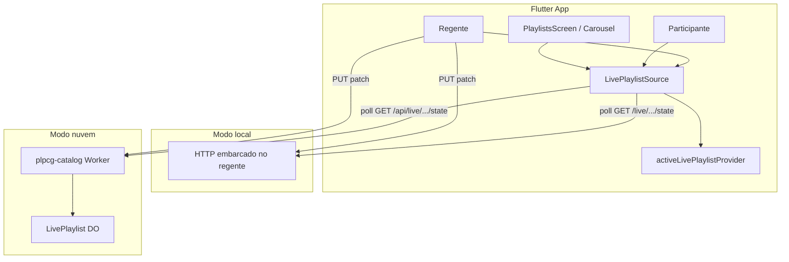

# UC-16 — Lista ao vivo (local P2P + nuvem DO)

**Criado em:** 2026-06-16  
**Status:** Planejado — **não implementado**  
**Público:** agente de desenvolvimento via `/plpcg-feature-dev UC-16`  
**Complementa:** UC-06, UC-07, UC-15, [FEATURE_INDEX.md](../features/FEATURE_INDEX.md)  
**Depende de:** UC-06 (modelo de lista); UC-15 recomendado antes do **modo nuvem** (auth do regente)

---

## 1. Objetivo

Permitir que um usuário (**regente**) conduza uma **lista ao vivo** — uma playlist especial, mutável em tempo quase real — enquanto **participantes** acompanham a mesma ordem de louvores e, opcionalmente, o **louvor atual** no carousel/leitor.

Para o PLPCG, continua sendo **uma lista** (nome, `pdfIds`, ordem). A diferença em relação à UC-06 é o **modo de propagação**:

| Modo | Cenário típico | Internet | Backend |
|------|----------------|----------|---------|
| **Local (P2P)** | Culto presencial, rede Wi‑Fi ou hotspot do regente | Não obrigatória | Host embarcado no dispositivo do regente |
| **Nuvem (DO)** | Evento online grande, participantes remotos | Obrigatória | Cloudflare Durable Object + Worker |

**Decisões arquiteturais:**

- **Sem WebSocket** — clientes usam **REST + polling** com `version` / `304 Not Modified` (mesmo contrato nos dois modos).
- **Dois modos explícitos** na UI — não unificar host local + uplink nuvem no MVP.
- **Lista ao vivo ≠ lista salva (UC-06)** — entidade e fluxo separados; opcionalmente converter em lista salva ao encerrar.

---

## 2. Terminologia

| Termo | Significado | Evitar |
|-------|-------------|--------|
| **Lista ao vivo** | Playlist mutável compartilhada enquanto ativa | “Sessão”, “room” na UI |
| **Lista salva** | Playlist UC-06 persistida em Isar (e D1 na UC-15) | — |
| **Regente** | Usuário que cria e edita a lista ao vivo | “Host” na UI (ok em código: `LivePlaylistHost`) |
| **Participante** | Usuário que acompanha a lista ao vivo (somente leitura) | “Viewer”, “audience” na UI |
| **Código de entrada** | Identificador curto para participantes entrarem (`ABC123`) | “Session code” |
| **Modo local** | Lista ao vivo servida via HTTP na LAN | “P2P mesh” |
| **Modo nuvem** | Lista ao vivo servida via Worker → Durable Object | — |

---

## 3. Escopo

### Dentro do escopo (MVP)

| Item | Modo local | Modo nuvem |
|------|------------|------------|
| Criar lista ao vivo a partir do carousel ou lista salva | ✅ | ✅ |
| Editar ordem / adicionar / remover louvores (regente) | ✅ | ✅ |
| Sincronizar `currentIndex` (louvor atual no carousel) | ✅ | ✅ |
| Participante entra via código + QR | ✅ | ✅ |
| Polling REST (`sinceVersion`) | ✅ | ✅ |
| Encerrar lista ao vivo | ✅ | ✅ |
| Salvar snapshot como lista salva UC-06 | ✅ | ✅ |

### Fora do escopo (adiar)

| Item | Motivo |
|------|--------|
| WebSocket / SSE | Complexidade; polling suficiente para ordem de louvores |
| Edição colaborativa (vários regentes) | Um regente por lista ao vivo no MVP |
| Login obrigatório para participante | Atrito no culto; código de entrada basta |
| Mesh P2P (todos iguais) | Host central na LAN é mais simples e previsível |
| Uplink simultâneo local + nuvem | Escolha explícita de modo na criação |
| Persistência longa da lista ao vivo na nuvem | Estado efêmero no DO; snapshot opcional → D1/Isar |
| Sync UC-15 bidirecional durante lista ao vivo | Lista ao vivo usa canal próprio |

---

## 4. Contexto do codebase

### Já implementado (reutilizar)

| Peça | Local | Uso na UC-16 |
|------|-------|--------------|
| Modelo de lista (`nome`, `pdfIds[]`) | `SavedPlaylist`, Isar `Playlist` | Espelhar campos na lista ao vivo |
| Lista ativa no carousel | `activePlaylistIdProvider` | Paralelo: `activeLivePlaylistProvider` |
| Carousel / leitor | UC-05, UC-11 | Consumir `pdfIds` + `currentIndex` da fonte ao vivo |
| Share URL estático | UC-07 | Fallback offline; não substitui lista ao vivo |
| HTTP client | `dio_provider.dart` | Modo nuvem; modo local usa Dio com `baseUrl` LAN |
| `connectivity_plus` | pubspec | Detectar online/offline para sugerir modo |

### Lacunas a preencher

- Feature `live_playlist` (ou subfeature em `playlists/`)
- `LivePlaylistSource` — abstração com implementações local e nuvem
- Servidor HTTP embarcado no regente (modo local)
- Durable Object `LivePlaylist` + rotas Worker (modo nuvem)
- UI: criar / entrar / reger / encerrar lista ao vivo
- QR com URL/código de entrada

---

## 5. Arquitetura



### Princípio: contrato REST idêntico

O **mesmo JSON de estado** e os **mesmos verbos HTTP** funcionam nos dois modos. Só muda a `baseUrl`:

| Modo | Base URL exemplo |
|------|------------------|
| Local | `http://192.168.43.1:8765` |
| Nuvem | `https://plpcg.com/api/live` |

Implementação Flutter: `LocalLivePlaylistSource` vs `CloudLivePlaylistSource` implementam `LivePlaylistSource`.

---

## 6. Modelo de dados

### Estado da lista ao vivo (`LivePlaylistState`)

```json
{
  "livePlaylistId": "550e8400-e29b-41d4-a716-446655440000",
  "joinCode": "ABC123",
  "nome": "Culto domingo",
  "pdfIds": ["Q29s...", "QXZ1..."],
  "currentIndex": 2,
  "version": 15,
  "updatedAt": "2026-06-16T18:30:00.000Z",
  "mode": "local",
  "status": "active"
}
```

| Campo | Tipo | Descrição |
|-------|------|-----------|
| `livePlaylistId` | UUID | ID estável da lista ao vivo |
| `joinCode` | string 6 chars | Código humano para entrada (modo nuvem: chave DO via `idFromName`) |
| `nome` | string | Nome exibido (como UC-06) |
| `pdfIds` | string[] | Ordem dos louvores — mesmo encoding Base64 da UC-06 |
| `currentIndex` | int | Índice ativo no carousel (`0..pdfIds.length-1`; `-1` se vazio) |
| `version` | int | Incrementa a cada mutação; base do polling |
| `updatedAt` | ISO-8601 UTC | Timestamp da última mutação |
| `mode` | `"local"` \| `"cloud"` | Informacional para UI |
| `status` | `"active"` \| `"ended"` | Listas encerradas rejeitam mutações |

### Token do regente (modo local)

Gerado na criação; participantes não precisam dele.

```json
{
  "regentToken": "random-256-bit-hex",
  "expiresAt": null
}
```

Modo nuvem: regente autenticado via JWT Google (UC-15); `sub` gravado no DO como `regentUserId`.

### Relação com UC-06

| UC-06 (lista salva) | UC-16 (lista ao vivo) |
|---------------------|------------------------|
| Persistida em Isar | Estado em memória (local) ou DO (nuvem) |
| CRUD offline-first | Mutável enquanto `status == active` |
| Rascunhos (`salva == false`) | N/A — lista ao vivo é sempre “ativa” |
| Sync D1 (UC-15) | Canal separado |

**Ao encerrar:** opcional `SaveLivePlaylistAsSaved` → cria/atualiza playlist UC-06 com snapshot final.

---

## 7. API REST (contrato compartilhado)

Polling a cada **2–3 s** em participantes; regente pode usar intervalo menor ou push otimista local após PUT.

### Endpoints (paths relativos à base do modo)

| Método | Path | Auth | Descrição |
|--------|------|------|-----------|
| POST | `/live` | Regente | Cria lista ao vivo; retorna estado + token (local) ou exige JWT (nuvem) |
| GET | `/live/:joinCode/state?sinceVersion=N` | Não | Poll; `304` se `version <= N` |
| PUT | `/live/:joinCode` | Regente | Patch: `nome`, `pdfIds`, `currentIndex` (versionamento otimista) |
| POST | `/live/:joinCode/end` | Regente | `status → ended` |
| GET | `/live/:joinCode` | Não | Metadados públicos (nome, mode, status) — opcional |

### GET state — polling

```text
Request:  GET /live/ABC123/state?sinceVersion=14
Response: 304 Not Modified          (se version ainda é 14)
       ou 200 { ... LivePlaylistState, version: 15 }
```

### PUT — regente

```text
Request:
  Authorization: Bearer <regentToken>   (local)
  Authorization: Bearer <google_id_token> (nuvem)
  Body: { "version": 14, "pdfIds": [...], "currentIndex": 3 }

Server:
  - version match → apply, version++, updatedAt=now, return 200 + estado
  - version stale → 409 + estado atual
  - status ended → 410 Gone
```

### Payload de criação (POST)

```json
{
  "nome": "Culto domingo",
  "pdfIds": ["Q29s...", "QXZ1..."],
  "currentIndex": 0,
  "sourcePlaylistId": "uuid-opcional-da-lista-salva"
}
```

---

## 8. Modo local (P2P via host)

### Fluxo

```text
1. Regente escolhe "Lista ao vivo — nesta rede"
2. App inicia servidor HTTP embarcado (porta configurável, default 8765)
3. App gera joinCode + regentToken; exibe QR (IP + código)
4. Participantes: "Entrar em lista ao vivo" → escaneiam QR ou digitam IP + código
5. Participantes poll GET /live/:joinCode/state
6. Regente edita carousel → PUT local → participantes recebem no próximo poll
7. Regente encerra → POST /end → servidor para (ou timeout)
```

### Descoberta

| Método | Prioridade | Notas |
|--------|------------|-------|
| QR code | MVP | `plpcg://live/local?host=192.168.43.1&port=8765&code=ABC123` |
| Código + IP manual | MVP fallback | Essencial em redes de igreja sem mDNS |
| mDNS (`_plpcg-live._tcp`) | Pós-MVP | Conveniência; não depender disso |

### Servidor embarcado (Flutter)

- Pacote candidato: `shelf` + `shelf_router` — **aprovação explícita** antes de adicionar.
- Bind em `0.0.0.0` na porta escolhida.
- Android: considerar **foreground service** enquanto lista ao vivo ativa (host não dorme).
- iOS: host exige app em **foreground**; documentar limitação na UX.

### Segurança local

- `regentToken` obrigatório em PUT/POST end.
- Participantes só GET.
- Rate limit simples por IP no host (opcional MVP).
- Lista ao vivo local **não** expõe dados de outras playlists do dispositivo.

### Rede

- Hotspot do regente: cenário principal offline.
- Wi‑Fi da igreja: funciona se dispositivos na mesma sub-rede; firewall pode bloquear — QR com IP direto.

---

## 9. Modo nuvem (Durable Object)

### Fluxo

```text
1. Regente autenticado (UC-15) escolhe "Lista ao vivo — na nuvem"
2. POST /api/live → Worker valida JWT → cria/obtém DO idFromName(joinCode)
3. Worker retorna joinCode + livePlaylistId + URL pública de entrada
4. Regente compartilha link: https://plpcg.com/live/ABC123 (deep link UC-16)
5. Participantes abrem link ou digitam código; poll GET /api/live/ABC123/state
6. Regente edita → PUT com JWT → DO atualiza estado
7. Regente encerra → POST end → status=ended; DO pode hibernar
```

### Durable Object — `LivePlaylist`

**Arquivo sugerido:** `workers/plpcg-catalog/src/live_playlist/live_playlist_do.ts`

```typescript
// Estado persistido no SQLite interno do DO
interface StoredLivePlaylist {
  livePlaylistId: string;
  joinCode: string;
  regentUserId: string;      // Google sub
  nome: string;
  pdfIds: string;            // JSON array
  currentIndex: number;
  version: number;
  updatedAt: string;
  status: "active" | "ended";
  createdAt: string;
}
```

**Métodos RPC (via Worker fetch handler):**

- `create(initial, regentUserId)`
- `getState(sinceVersion?)`
- `applyPatch(patch, regentUserId, expectedVersion)`
- `end(regentUserId)`

**Sharding:** `env.LIVE_PLAYLIST.idFromName(joinCode)` — um DO por lista ao vivo.

### wrangler.jsonc — adicionar

```jsonc
{
  "durable_objects": {
    "bindings": [
      { "name": "LIVE_PLAYLIST", "class_name": "LivePlaylistDurableObject" }
    ]
  },
  "migrations": [
    { "tag": "v2-live-playlist", "new_sqlite_classes": ["LivePlaylistDurableObject"] }
  ]
}
```

### Rotas Worker

| Método | Path | Auth |
|--------|------|------|
| POST | `/api/live` | JWT Google (UC-15) |
| GET | `/api/live/:joinCode/state` | Público |
| PUT | `/api/live/:joinCode` | JWT + `sub === regentUserId` |
| POST | `/api/live/:joinCode/end` | JWT + regente |
| GET | `/api/live/:joinCode` | Público (metadados) |

**CORS:** rotas `/api/live/*` — mesma política restritiva da UC-15 (não `*`).

### Por que DO e não D1?

- Estado **efêmero**, alta frequência de leitura (poll de N participantes).
- **Consistência forte** por lista ao vivo sem conflitos de row D1.
- DO hiberna quando encerrada — custo baixo.
- D1 permanece para listas salvas sync (UC-15); snapshot final pode gravar lá via PUT `/api/playlists/:id`.

### Escala (eventos online grandes)

- Polling com `304` reduz payload quando nada muda.
- Sugestão: intervalo adaptativo (3 s idle → 1 s quando `version` mudou recentemente).
- Rate limit por `joinCode` e por IP no Worker.
- Limite soft documentado: ~500 participantes simultâneos por lista (ajustar após testes).

---

## 10. Flutter — estrutura

### Nova feature (sugestão)

```
lib/features/live_playlist/
  domain/
    entities/live_playlist_state.dart
    repositories/live_playlist_source.dart    # interface
    usecases/
      create_local_live_playlist.dart
      create_cloud_live_playlist.dart
      join_live_playlist.dart
      watch_live_playlist_state.dart          # Stream via polling
      update_live_playlist_as_regent.dart
      end_live_playlist.dart
      save_live_playlist_as_saved.dart        # → UC-06
  data/
    sources/local_live_playlist_source.dart   # HTTP client → host LAN
    sources/cloud_live_playlist_source.dart   # Dio → plpcg.com
    server/local_live_playlist_server.dart    # shelf — só modo local
  presentation/
    providers/
      active_live_playlist_provider.dart      # substitui fonte do carousel quando ativo
      live_playlist_role_provider.dart        # regent | participant | none
    pages/
      create_live_playlist_page.dart
      join_live_playlist_page.dart
      regent_live_playlist_page.dart          # QR, código, encerrar
    widgets/
      live_playlist_badge.dart
      live_playlist_qr_card.dart
```

### Abstração central

```dart
abstract class LivePlaylistSource {
  Stream<LivePlaylistState> watchState({Duration pollInterval});
  Future<LivePlaylistState> fetchState({int? sinceVersion});
  Future<LivePlaylistState> create(CreateLivePlaylistParams params);
  Future<LivePlaylistState> applyPatch(LivePlaylistPatch patch);
  Future<void> end();
  void dispose();
}
```

### Integração com carousel

Quando `activeLivePlaylistProvider` tem valor:

1. `pdfIds` e `currentIndex` vêm do `LivePlaylistState` (stream).
2. Edições do regente no carousel disparam `applyPatch`.
3. Participante: carousel **somente leitura**; segue `currentIndex` do regente (configurável: auto-sync ou manual).

Quando não há lista ao vivo ativa: comportamento UC-06 inalterado.

### Deep link

Estender UC-14 / `DeepLinkConfig`:

- Nuvem: `https://plpcg.com/live/:joinCode`
- Local (QR): `plpcg://live/local?host=...&port=...&code=...`

---

## 11. Fluxos de use case

### UC-16.1 — Regente cria lista ao vivo (local)

| Campo | Valor |
|-------|-------|
| **Ator** | Regente |
| **Pré-condições** | Carousel com ≥1 louvor ou lista salva selecionada |
| **Fluxo** | Criar → servidor local sobe → QR exibido → regente edita → participantes entram |
| **Pós-condições** | `LivePlaylistSource` ativo; carousel na fonte ao vivo |

### UC-16.2 — Participante entra em lista ao vivo (local)

| Campo | Valor |
|-------|-------|
| **Ator** | Participante |
| **Pré-condições** | Mesma rede que o regente; código ou QR |
| **Fluxo** | Entrar → poll → carousel espelha estado |
| **Pós-condições** | Modo participante; sem mutação |

### UC-16.3 — Regente cria lista ao vivo (nuvem)

| Campo | Valor |
|-------|-------|
| **Ator** | Regente autenticado (UC-15) |
| **Pré-condições** | Login Google; rede disponível |
| **Fluxo** | POST /api/live → compartilha link/código → edição via PUT |
| **Pós-condições** | DO ativo; link público de entrada |

### UC-16.4 — Participante entra em lista ao vivo (nuvem)

| Campo | Valor |
|-------|-------|
| **Ator** | Participante |
| **Pré-condições** | Código ou link; rede disponível |
| **Fluxo** | GET state poll → acompanha lista |
| **Pós-condições** | Carousel somente leitura |

### UC-16.5 — Encerrar e salvar como lista salva

| Campo | Valor |
|-------|-------|
| **Ator** | Regente |
| **Fluxo** | Encerrar → dialog "Salvar como lista?" → UC-06 Create/Update playlist |
| **Pós-condições** | Lista ao vivo `ended`; snapshot opcional em Isar |

---

## 12. UX

### PlaylistsScreen / Carousel

| Estado | UI |
|--------|-----|
| Sem lista ao vivo | Ações atuais UC-06; novo item: **"Iniciar lista ao vivo"** |
| Regente local | Badge **"Ao vivo · local"**; botão QR; encerrar |
| Regente nuvem | Badge **"Ao vivo · nuvem"**; compartilhar link |
| Participante | Badge **"Acompanhando · [nome]"**; sair |
| Encerrada pelo regente | Snackbar; voltar à lista salva anterior ou vazio |

### Escolha de modo (dialog na criação)

```text
Onde as pessoas vão acompanhar?

[ Nesta rede ]     — sem internet; ideal para culto presencial
[ Na nuvem ]       — internet; ideal para eventos online
```

### Participante sem login

- Modo local: QR ou IP + código.
- Modo nuvem: link `plpcg.com/live/ABC123` — app abre e entra direto.

### Louvor atual (`currentIndex`)

- **Regente:** ao trocar PDF no carousel, PATCH `currentIndex`.
- **Participante (default):** carousel acompanha regente automaticamente.
- **Participante (opcional pós-MVP):** modo "navegação livre" local sem afetar regente.

---

## 13. Segurança

| # | Regra | Modo local | Modo nuvem |
|---|-------|------------|------------|
| S1 | Mutations só com credencial de regente | `regentToken` | JWT + `sub == regentUserId` |
| S2 | Participante nunca envia PUT | ✅ | ✅ |
| S3 | `joinCode` não enumerável trivialmente | 6 chars alfanumérico | idem + rate limit |
| S4 | Lista encerrada não aceita PATCH | ✅ | ✅ |
| S5 | Não expor playlists salvas do regente | Servidor só expõe lista ao vivo | DO isolado por `joinCode` |
| S6 | HTTPS na nuvem | N/A | Obrigatório |
| S7 | Rate limit GET state | Host opcional | Worker por IP + joinCode |

---

## 14. Ordem de implementação

```text
Pré-requisito recomendado: UC-06 ✅ (já concluída)

Fase A — Domínio + contrato
  A1. LivePlaylistState + LivePlaylistSource interface
  A2. Testes unitários de merge/version no patch
  A3. l10n strings lista ao vivo

Fase B — Modo local (prioridade culto presencial)
  B1. local_live_playlist_server (shelf) + testes
  B2. LocalLivePlaylistSource + polling Stream
  B3. UI regente: criar, QR, encerrar
  B4. UI participante: entrar, acompanhar
  B5. Integração activeLivePlaylistProvider → carousel

Fase C — Modo nuvem (depende UC-15 para regente)
  C1. LivePlaylistDurableObject + wrangler migration
  C2. Rotas Worker + testes vitest/miniflare
  C3. CloudLivePlaylistSource
  C4. Deep link /live/:joinCode
  C5. UI compartilhar link nuvem

Fase D — Polish
  D1. save_live_playlist_as_saved → UC-06
  D2. Testes integração Flutter (local com mock server)
  D3. Atualizar FEATURE_INDEX.md
```

**Sugestão:** entregar **Fase B antes de C** — valida UX no culto sem infra cloud nova.

---

## 15. Critérios de pronto

| # | Critério |
|---|----------|
| P1 | Regente cria lista ao vivo local; participante na mesma rede acompanha em ≤5 s após edição |
| P2 | Regente cria lista ao vivo nuvem (logado); participante remoto acompanha via código/link |
| P3 | Participante não consegue editar ordem (PUT rejeitado) |
| P4 | `currentIndex` do regente reflete no carousel do participante |
| P5 | Encerrar lista ao vivo para polling e exibe estado final |
| P6 | Opcional: salvar snapshot como lista salva UC-06 |
| P7 | UC-06 / UC-07 inalterados quando nenhuma lista ao vivo ativa |
| P8 | Modo local funciona sem internet após criação |
| P9 | `flutter analyze` sem erros; testes novos passando |

---

## 16. Testes

### Modo local

- Servidor: GET state 304 quando version igual
- Servidor: PUT sem token → 401
- Flutter: `watchState` emite novo estado após PUT simulado

### Modo nuvem (vitest + miniflare)

- POST sem JWT → 401
- PUT com JWT de outro sub → 403
- Poll 304 / 200 conforme version
- end → GET state retorna `status: ended`; PUT → 410

### Manual

1. Dois dispositivos no hotspot: regente edita → participante vê ordem nova.
2. Regente nuvem + participante 4G: link de entrada funciona.
3. Encerrar → participante recebe estado encerrado no próximo poll.

---

## 17. Riscos e mitigações

| Risco | Mitigação |
|-------|-----------|
| iOS mata servidor local em background | UX: manter app aberto; aviso ao regente |
| Firewall LAN bloqueia porta | QR com IP; instrução hotspot |
| Latência polling 2–3 s | Aceitável para louvores; intervalo adaptativo pós-MVP |
| joinCode adivinhável | 6+ chars; rate limit; código rotacionável pós-MVP |
| DO custo em evento grande | 304 agressivo; encerrar após evento |
| Confusão lista ao vivo vs salva | Badge persistente; nomenclatura consistente |

---

## 18. Relação com outros UCs

| UC | Relação |
|----|---------|
| UC-06 | Snapshot final → lista salva; modelo `pdfIds` / `nome` |
| UC-07 | Share URL estático permanece; fallback offline one-shot |
| UC-15 | Auth do regente no modo nuvem; D1 para persistir snapshot |
| UC-05 / UC-11 | Carousel consome fonte ao vivo quando ativa |
| UC-14 | Deep links `/live/:joinCode` |

---

## 19. Referências

| Documento | Relevância |
|-----------|------------|
| [UC-06-manage-playlists.md](./UC-06-manage-playlists.md) | Modelo de lista |
| [UC-07-share-playlist-url.md](./UC-07-share-playlist-url.md) | Share estático |
| [USER_AUTH_PLAYLIST_SYNC_SPEC.md](../USER_AUTH_PLAYLIST_SYNC_SPEC.md) | Auth + sync (UC-15) |
| [Cloudflare Durable Objects](https://developers.cloudflare.com/durable-objects/) | Modo nuvem |
| [FEATURE_INDEX.md](../features/FEATURE_INDEX.md) | Índice de features |

---

## 20. Invocação para agente

```text
/plpcg-uc-refinement UC-16
/plpcg-feature-dev UC-16
```

**Ordem sugerida:** Fase B (local) → UC-15 (se ainda não feita) → Fase C (nuvem).

**Contexto mínimo a anexar:** este arquivo.

---

*Versão 1.0 — 2026-06-16*
